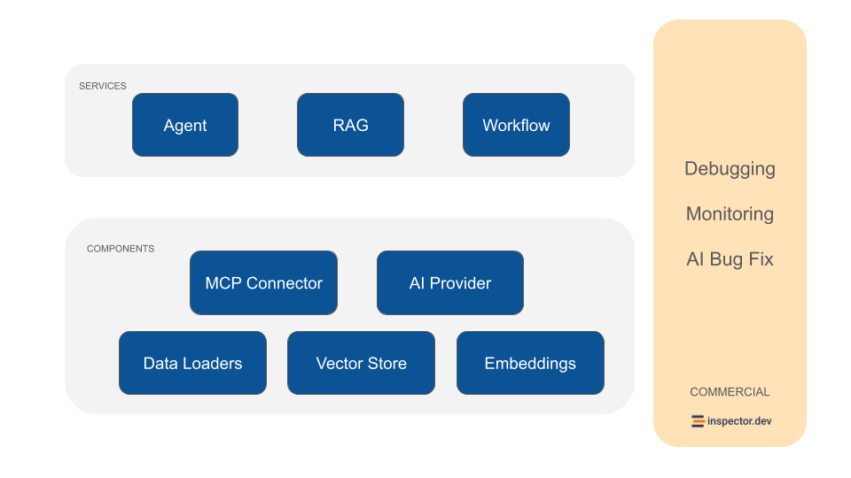

# Introduction

### What is Neuron

Neuron is a PHP framework for developing agentic applications. By handling the heavy lifting of orchestration, data loading, and debugging, Neuron clears the path for you to focus on the creative soul of your project. From the first line of code to a fully orchestrated multi-agent system, you have the freedom to build AI entities that think and act exactly how you envision them.

We provide tools for the entire agentic application development lifecycle, from LLM interfaces, to data loading, to multi-agent orchestration, to monitoring and debugging. In addition, we provide [tutorials and other educational content](overview/fast-learning-by-video.md) to help you get started using AI Agents in your projects.

<figure><figcaption><p>Neuron architecture</p></figcaption></figure>

### Getting Started In 3 Steps

**1) Install** Neuron in you project:

```shellscript
composer require neuron-core/neuron-ai
```

**2) Create** an agent extending the `Agent` class:

```php
namespace App\Neuron;

use NeuronAI\Agent\Agent;
use NeuronAI\Providers\Anthropic\Anthropic;

class MyAgent extends Agent
{
    protected function provider(): AIProviderInterface
    {
        // return an AI provider (Anthropic, OpenAI, Ollama, Gemini, etc.)
        return new Anthropic(
            key: 'ANTHROPIC_API_KEY',
            model: 'ANTHROPIC_MODEL',
        );
    }
}
```

**3) Talk** with the agent:

```php
use NeuronAI\Chat\Messages\UserMessage;

$message = MyAgent::make()
    ->chat(new UserMessage("Hi, who are you?"))
    ->getMessage();

echo $message->getContent();
// I'm a friendly AI Agent built with Neuron AI framework, how can I help you today?
```

### Demo with Laravel

Neuron offers a well defined encapsulation pattern, allowing you to work on your AI components in a dedicated namespace. You can enjoy the exact same experience of the other ecosystem packages you already love, like Filament, Nova, Horizon, etc.

<a href="https://www.youtube.com/watch?v=oSA1bP_j41w" class="button primary" data-icon="youtube">Watch the demo</a>

<a href="https://github.com/neuron-core/neuron-ai" class="button primary" data-icon="laravel">Official Laravel Package</a>

### Demo with Symfony

All Neuron components belong to its own interface, so you can easily define dependencies and automate objects creation using the Symfony service container. Watch how it works in a real project.

<a href="https://www.youtube.com/watch?v=JWRlcaGnsXw" class="button primary" data-icon="youtube">Symfony &#x26; Neuron</a>

### Support For Multiple Providers

Neuron uses a common interface for large language models (`AIProviderInterface`) as well as for the other components, such as [embedding](rag/embeddings-provider.md), [vector stores](rag/vector-store.md), [toolkits](agent/tools.md#toolkits-composable-agent-capabilities), etc. The modular architecture allows you to swap components as needed, whether you're changing LLM provider, adjusting memory backends, or scaling across multiple servers.

Here are a couple of examples:



```php
namespace App\Neuron;

use NeuronAI\Agent\Agent;
use NeuronAI\Chat\Messages\UserMessage;
use NeuronAI\Providers\AIProviderInterface;
use NeuronAI\Providers\Anthropic\Anthropic;

class MyAgent extends Agent
{
    protected function provider(): AIProviderInterface
    {
        return new Anthropic(
            key: 'ANTHROPIC_API_KEY',
            model: 'ANTHROPIC_MODEL',
        );
    }
}

$message = MyAgent::make()
    ->chat(new UserMessage("Hi!"))
    ->getMessage();

echo $message->getContent();
// Hi, how can I help you today?
```



```php
namespace App\Neuron;

use NeuronAI\Agent\Agent;
use NeuronAI\Chat\Messages\UserMessage;
use NeuronAI\Providers\AIProviderInterface;
use NeuronAI\Providers\Ollama\Ollama;

class MyAgent extends Agent
{
    protected function provider(): AIProviderInterface
    {
        return new Ollama(
            url: 'OLLAMA_URL',
            model: 'OLLAMA_MODEL',
        );
    }
}

$message = MyAgent::make()
    ->chat(new UserMessage("Hi!"))
    ->getMessage();

echo $message->getContent();
// Hi, how can I help you today?
```



```php
namespace App\Neuron;

use NeuronAI\Agent\Agent;
use NeuronAI\Chat\Messages\UserMessage;
use NeuronAI\Providers\AIProviderInterface;
use NeuronAI\Providers\OpenAI\OpenAI;

class MyAgent extends Agent
{
    protected function provider(): AIProviderInterface
    {
        return new OpenAI(
            key: 'OPENAI_API_KEY',
            model: 'OPENAI_MODEL',
        );
    }
}

$message = MyAgent::make()
    ->chat(new UserMessage("Hi!"))
    ->getMessage();

echo $message->getContent();
// Hi, how can I help you today?
```



```php
namespace App\Neuron;

use NeuronAI\Agent\Agent;
use NeuronAI\Chat\Messages\UserMessage;
use NeuronAI\Providers\AIProviderInterface;
use NeuronAI\Providers\Gemini\Gemini;

class MyAgent extends Agent
{
    protected function provider(): AIProviderInterface
    {
        return new Gemini(
            key: 'GEMINI_API_KEY',
            model: 'GEMINI_MODEL',
        );
    }
}

$message = MyAgent::make()
    ->chat(new UserMessage("Hi!"))
    ->getMessage();

echo $message->getContent();
// Hi, how can I help you today?
```



```php
namespace App\Neuron;

use NeuronAI\Agent\Agent;
use NeuronAI\Chat\Messages\UserMessage;
use NeuronAI\Providers\AIProviderInterface;
use NeuronAI\Providers\Gemini\Mistral;

class MyAgent extends Agent
{
    protected function provider(): AIProviderInterface
    {
        return new Mistral(
            key: 'MISTRAL_API_KEY',
            model: 'MISTRAL_MODEL',
        );
    }
}

$message = MyAgent::make()
    ->chat(new UserMessage("Hi!"))
    ->getMessage();

echo $message->getContent();
// Hi, how can I help you today?
```



Check out all the supported providers in the [AI Provider](providers/ai-provider.md) section.

### Video Tutorials



More resources here: [Video Tutorials](overview/fast-learning-by-video.md#video)

### Why Neuron Is Unique

Most agentic frameworks ask you to pick a side. Some are simple enough to learn in an afternoon, and you hit a wall the first time your use case grows beyond a demo. Others are powerful enough for a use case but you spend weeks fighting their abstractions before you ship anything real.

Neuron is built on a Workflow architecture that removes those compromises. The first spark came from the Workflow concept on LLmaindex in the Python world. Shaped around the patterns of modern PHP, the Neuron Workflow is a PHP native solution that now follows a path of its own, one we continue to draw as the agentic ecosystem in PHP takes shape around it.

**The result is one foundation that a newcomer can pick up on the first day, and that already carries everything a serious agent needs underneath**: unified messaging layer, tools & toolkits, MCP, human-in-the-loop, agentic UI protocols, multi-agent interactions, asynchronous execution, and more. You never switch frameworks when your project gets ambitious. The architecture you learned at the start of this journey is the same one running your most complex system in production in the future.

### A Vertical & Independent Ecosystem

Neuron is also the only vertical ecosystem for agentic applications development in PHP. Around the framework there is a registry of extensions, tools, and technologies designed specifically for agentic applications, and a growing number of companies building on the same architecture instead of assembling their own from scattered parts.

For a software house, this is a place to be recognized as a specialist rather than one more team claiming AI experience. For a company that needs an agentic foundation it can commit to for years, it means standardizing on an architecture whose whole direction is this space, not a general-purpose library where agents are a side feature.

## Resources

### [E-Book - "Start With AI Agents In PHP"](https://www.amazon.it/dp/B0F1YX8KJB)

The gap between modern agentic technologies and traditional PHP development has been widening in recent years. While Python developers enjoy a wealth of libraries and frameworks to create AI Agents, PHP developers have often been left wondering how they can participate in this technological revolution without completely retooling their skillsets or rebuilding their applications from scratch.

Neuron changes all that.

This book serves as both an introduction to AI Agents concepts for developers and a comprehensive guide to Neuron framework.

<a href="https://www.amazon.com/dp/B0F1YX8KJB" class="button secondary" data-icon="amazon">Get on Amazon</a>

<a href="https://play.google.com/store/books/details?pcampaignid=books_read_action&#x26;id=agJPEQAAQBAJ&#x26;pli=1" class="button secondary" data-icon="google">Get on GooglePlay</a>

### [Newsletter](https://neuron-ai.dev)

Register to the Neuron internal [newsletter](https://neuron-ai.dev/) to get informative papers, articles, and best practices on how to start with AI development in PHP.

You will learn how to approach AI systems in the right way, understand the most important technical concepts behind LLMs, and how to start implementing your AI solutions into your PHP application with the Neuron AI framework.

### [Forum](https://github.com/inspector-apm/neuron-ai/discussions)

We’re using [Discussions](https://github.com/inspector-apm/neuron-ai/discussions) as a place to connect with PHP developers working on Neuron to create their Agentic applications. We hope that you:

* Ask questions you’re wondering about.
* Share ideas.
* Engage with other community members.
* Welcome others and are open-minded.

### [**Inspector.dev**](https://inspector.dev)

Neuron is part of the Inspector ecosystem as a trustable platform to create reliable and scalable AI driven solutions.

Trace and evaluate your agents execution flow to help you maintain production grade implementations with confidence. Check out the [**monitoring integrations**](agent/observability.md).

## Keep In Touch

* Website & Newsletter: [https://neuron-ai.dev](https://neuron-ai.dev/)
* Repository: [https://github.com/neuron-core/neuron-ai](https://github.com/inspector-apm/neuron-ai)
* Inspector: [https://inspector.dev](https://inspector.dev)
* E-Book: [https://www.amazon.it/dp/B0F1YX8KJB](https://www.amazon.it/dp/B0F1YX8KJB)
* Linkedin: [https://www.linkedin.com/company/neuron-ai-php-framework](https://www.linkedin.com/company/neuron-ai-php-framework)
* X: [https://x.com/neuronai\_php](https://x.com/neuronai_php)
* Instagram: [https://www.instagram.com/neuronai\_php\_adk/](https://www.instagram.com/neuronai_php_adk/)
