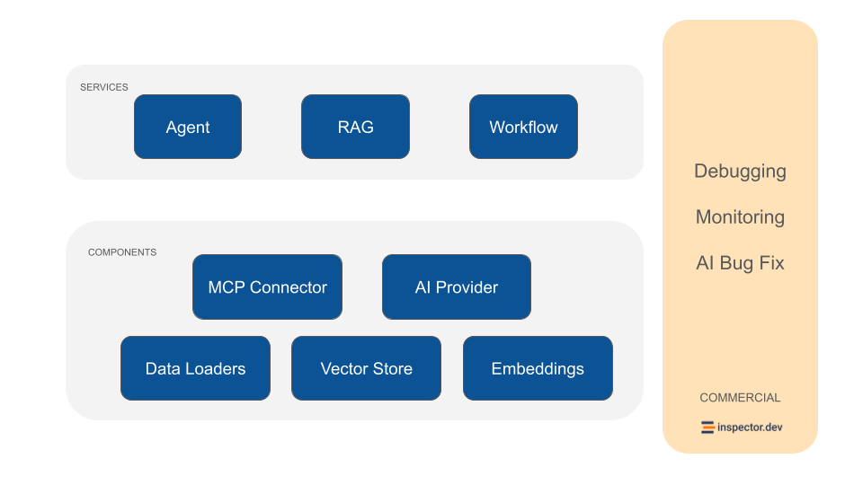

# Introduction

### What is Neuron

Neuron is a PHP framework for developing agentic applications. By handling the heavy lifting of providers orchestration, memory management, UI integration, and debugging, Neuron clears the path for you to focus on the creative soul of your project. From the first line of code to a fully orchestrated multi-agent system, you have the freedom to build AI entities that think and act exactly how you envision them.

We provide tools for the entire agentic application development lifecycle, from LLM interfaces, to data loading, to multi-agent orchestration, to monitoring and debugging. In addition, we provide [tutorials and other educational content](overview/fast-learning-by-video.md) to help you get started using AI Agents in your projects.

<figure><figcaption><p>Neuron architecture</p></figcaption></figure>

### Start With One Prompt

Copy & paste this initial prompt to tell your conding agent how to install and configure Neuron AI in your project.

```
You are going to set up Neuron AI, a PHP framework for building agentic applications, 
in this project, and you must follow three steps in order. First, install the framework: 
check composer.json, and if neuron-core/neuron-ai is not already required, 
run `composer require neuron-core/neuron-ai`. Second, install the agent skills that ship 
with the package by running `npx skills add ./vendor/neuron-core/neuron-ai/skills -y` from 
the project root. The skills are symlinked, so they stay current whenever Neuron is 
updated through Composer. From then on, load the relevant skill before you write any Neuron 
code instead of relying on what you remember about the framework, because your memory may 
describe an older version. Third, work out what kind of app this is. Look at composer.json 
and the project structure to tell whether it is a Laravel app or a Symfony app, then 
activate the matching skill: neuron-laravel-integration or neuron-symfony-integration. 
If Neuron is already part of the app go through the skill's foundations checklist 
item by item. Report what differs from the recommended setup. If Neuron is not 
in the app yet, follow the same checklist to do the first setup. If the app uses 
neither framework, start from a plain PHP agent using the neuron-agent skill. 
Finish with a short summary of what you installed and what you found.
```

### Support For Multiple Providers

Neuron uses a common interface for LLM providers (`AIProviderInterface`) as well as for the other components, such as [memory](agent/chat-history-and-memory.md), [embedding](rag/embeddings-provider.md), [vector stores](rag/vector-store.md), [toolkits](agent/tools.md#toolkits-composable-agent-capabilities), etc. The modular architecture allows you to swap components as needed, whether you're changing LLM provider, adjusting memory backends, or scaling across multiple servers.

Here are a couple of examples:



```php
namespace App\Neuron;

use NeuronAI\Agent\Agent;
use NeuronAI\Chat\Messages\UserMessage;
use NeuronAI\Providers\AIProviderInterface;
use NeuronAI\Providers\Anthropic\Anthropic;

class MyAgent extends Agent
{
    protected function provider(): AIProviderInterface
    {
        return new Anthropic(
            key: 'ANTHROPIC_API_KEY',
            model: 'ANTHROPIC_MODEL',
        );
    }
}

$message = MyAgent::make()
    ->setThreadId('chat_id')
    ->chat(new UserMessage("Hi!"))
    ->getMessage();

echo $message->getContent();
// Hi, how can I help you today?
```



```php
namespace App\Neuron;

use NeuronAI\Agent\Agent;
use NeuronAI\Chat\Messages\UserMessage;
use NeuronAI\Providers\AIProviderInterface;
use NeuronAI\Providers\Ollama\Ollama;

class MyAgent extends Agent
{
    protected function provider(): AIProviderInterface
    {
        return new Ollama(
            url: 'OLLAMA_URL',
            model: 'OLLAMA_MODEL',
        );
    }
}

$message = MyAgent::make()
    ->setThreadId('chat_id')
    ->chat(new UserMessage("Hi!"))
    ->getMessage();

echo $message->getContent();
// Hi, how can I help you today?
```



```php
namespace App\Neuron;

use NeuronAI\Agent\Agent;
use NeuronAI\Chat\Messages\UserMessage;
use NeuronAI\Providers\AIProviderInterface;
use NeuronAI\Providers\OpenAI\OpenAI;

class MyAgent extends Agent
{
    protected function provider(): AIProviderInterface
    {
        return new OpenAI(
            key: 'OPENAI_API_KEY',
            model: 'OPENAI_MODEL',
        );
    }
}

$message = MyAgent::make()
    ->setThreadId('chat_id')
    ->chat(new UserMessage("Hi!"))
    ->getMessage();

echo $message->getContent();
// Hi, how can I help you today?
```



```php
namespace App\Neuron;

use NeuronAI\Agent\Agent;
use NeuronAI\Chat\Messages\UserMessage;
use NeuronAI\Providers\AIProviderInterface;
use NeuronAI\Providers\Gemini\Gemini;

class MyAgent extends Agent
{
    protected function provider(): AIProviderInterface
    {
        return new Gemini(
            key: 'GEMINI_API_KEY',
            model: 'GEMINI_MODEL',
        );
    }
}

$message = MyAgent::make()
    ->setThreadId('chat_id')
    ->chat(new UserMessage("Hi!"))
    ->getMessage();

echo $message->getContent();
// Hi, how can I help you today?
```



```php
namespace App\Neuron;

use NeuronAI\Agent\Agent;
use NeuronAI\Chat\Messages\UserMessage;
use NeuronAI\Providers\AIProviderInterface;
use NeuronAI\Providers\Gemini\Mistral;

class MyAgent extends Agent
{
    protected function provider(): AIProviderInterface
    {
        return new Mistral(
            key: 'MISTRAL_API_KEY',
            model: 'MISTRAL_MODEL',
        );
    }
}

$message = MyAgent::make()
    ->setThreadId('chat_id')
    ->chat(new UserMessage("Hi!"))
    ->getMessage();

echo $message->getContent();
// Hi, how can I help you today?
```



Check out all the supported providers in the [AI Provider](providers/ai-provider.md) section.

### Video Tutorials



More resources here: [Video Tutorials](overview/fast-learning-by-video.md#video)

### Why Neuron

Your next application will be agentic. A growing share of new software is no longer a web application with AI features added along the way, but an application born agentic, where the agent is the architecture itself, driving how the system reasons, acts, and talks to the user interface. Building this kind of application requires a specific set of foundations: event-driven workflows with checkpointing, human-in-the-loop, interruption, multi-agent orchestration, streaming, and agentic UI protocols like AG-UI and the Vercel AI SDK protocol, MCP, and asynchronous execution.

In the PHP ecosystem, this set of foundations exists in one place. Each one is a chapter of this documentation: [Workflow](https://app.gitbook.com/s/KdZBniMLt1dmzJJIvcKB/workflow), [Human in the loop](agent/tool-approval.md), [Streaming & UI protocols](agent/streaming.md#stream-adapters), [MCP](agent/mcp-connector.md), [Async](agent/async.md), [Middleware](workflow/middleware.md), [Evals](agent/evaluation.md).

There is also no second framework waiting for you when the project grows. The same Workflow that runs your first agent in the getting started guide runs a multi-agent system with state, loops, and human approvals in production. What you learn on day one is what you ship in future projects.

### A Vertical & Independent Ecosystem

Neuron is also the only vertical ecosystem for agentic applications development in PHP. Around the framework there is a registry of extensions, tools, and technologies designed specifically for agentic applications, and a growing number of companies building on the same architecture instead of assembling their own from scattered parts.&#x20;

For a software house, this is a place to be recognized as a specialist rather than one more team claiming AI experience. For a company that needs an agentic foundation it can commit to for years, it means standardizing on an architecture whose whole direction is this space, not a general-purpose library where agents are a side feature.

## Resources

### [E-Book - "Start With AI Agents In PHP"](https://www.amazon.it/dp/B0F1YX8KJB)

The gap between modern agentic technologies and traditional PHP development has been widening in recent years. While Python developers enjoy a wealth of libraries and frameworks to create AI Agents, PHP developers have often been left wondering how they can participate in this technological revolution without completely retooling their skillsets or rebuilding their applications from scratch.

Neuron changes all that.

This book serves as both an introduction to AI Agents concepts for developers and a comprehensive guide to Neuron framework.

<a href="https://www.amazon.com/dp/B0F1YX8KJB" class="button secondary" data-icon="amazon">Get on Amazon</a>&#x20;

<a href="https://play.google.com/store/books/details?pcampaignid=books_read_action&#x26;id=agJPEQAAQBAJ&#x26;pli=1" class="button secondary" data-icon="google">Get on GooglePlay</a>

### [Newsletter](https://neuron-ai.dev)

Register to the Neuron internal [newsletter](https://neuron-ai.dev/) to get informative papers, articles, and best practices on how to start with AI development in PHP.

You will learn how to approach AI systems in the right way, understand the most important technical concepts behind LLMs, and how to start implementing your AI solutions into your PHP application with the Neuron AI framework.

### [Forum](https://github.com/inspector-apm/neuron-ai/discussions)

We’re using [Discussions](https://github.com/inspector-apm/neuron-ai/discussions) as a place to connect with PHP developers working on Neuron to create their Agentic applications. We hope that you:

* Ask questions you’re wondering about.
* Share ideas.
* Engage with other community members.
* Welcome others and are open-minded.

### [**Inspector.dev**](https://inspector.dev)

Neuron is part of the Inspector ecosystem as a trustable platform to create reliable and scalable AI driven solutions.&#x20;

Trace and evaluate your agents execution flow to help you maintain production grade implementations with confidence. Check out the [**monitoring integrations**](agent/observability.md).

## Keep In Touch

* Website & Newsletter: [https://neuron-ai.dev](https://neuron-ai.dev/)
* Repository: [https://github.com/neuron-code/neuron-ai](https://github.com/inspector-apm/neuron-ai)
* Inspector: [https://inspector.dev](https://inspector.dev)
* E-Book: [https://www.amazon.it/dp/B0F1YX8KJB](https://www.amazon.it/dp/B0F1YX8KJB)
* Linkedin: [https://www.linkedin.com/company/neuron-ai-php-framework](https://www.linkedin.com/company/neuron-ai-php-framework)
* X: [https://x.com/neuronai\_php](https://x.com/neuronai_php)
* Instagram: [https://www.instagram.com/neuronai\_php\_adk/](https://www.instagram.com/neuronai_php_adk/)
