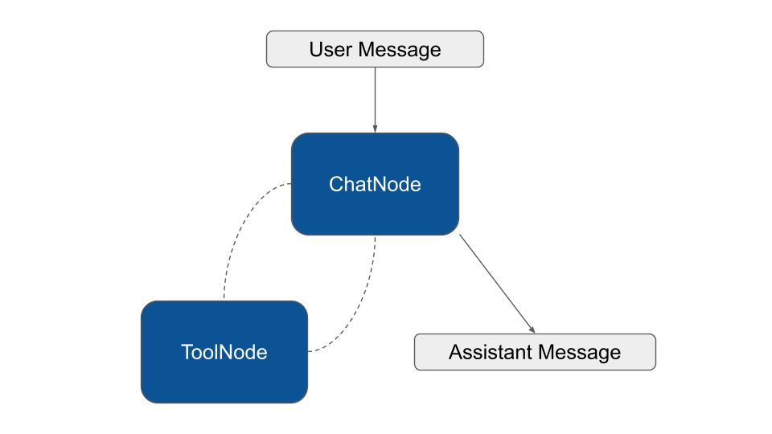

# Middleware

Middleware is a feature of the basic Workflow component. So you can attach custom middleware also to Agent and RAG to hook into their execution cycle.

### The Agent Workflow

The Agent class is an extension of the Workflow component. The Workflow is the foundational piece of the puzzle in Neuron. Many features of the Agent and RAG components inherit their logic from the capabilities of the underlying Workflow.

Here is a simple schema of the workflow used to create the agent implementation:

<figure><figcaption></figcaption></figure>

With this architecture in mind, you are free to use middleware to hook the  agent workflow, interruption to keep humans in the loop, or look below for a set of built-in components we provide for common use cases.

### Tool Approval (Human In The Loop)


Before using ToolApproval you should be familiar with the workflow [persistence](../workflow/persistence.md) and [interruption](../workflow/human-in-the-loop.md).


In Neuron, the Agent entity is built on top of the Workflow component. That means it can be interrupted to ask confirmation before performing critical actions. The `ToolApproval` middleware pause agent execution for human approval or rejection of tool calls before they execute.

```php
use NeuronAI\Agent\Agent;
use NeuronAI\Agent\Middleware\ToolApproval;
use NeuronAI\Workflow\Middleware\WorkflowMiddleware;
use NeuronAI\Workflow\NodeInterface;

class MyAgent extends Agent
{
    protected function provider(): AIProviderInterface
    {...}
    
    /**
     * Register tools
     */
    protected function tools(): array
    {
        return [
            BuyTicketTool::make(),
        ];
    }

    /**
     * Attach middleware to nodes.
     */
    protected function middleware(): array
    {
        return [
            ToolNode::class => [
                new ToolApproval(
                    // Provide a list of tool classes or names that need to be approved
                    tools: [BuyTicketTool::class]
                )
            ],
        ];
    }
}
```

Once the agent tries to call one of the listed tools in the `ToolApproval` middleware it fires the workflow interrutpion exception. You have to catch this exception, and present the user the UI to collect it's feedback. The interruption exception will contain an instance of `ApprovalRequest` with actions that require user feedback.

```php
use NeuronAI\Workflow\Interrupt\WorkflowInterrupt;
use NeuronAI\Workflow\Persistence\FilePersistence;

$persistence = new FilePersistence(__DIR__);

try {

    $response = new MyAgent($presistence)
        ->chat(new UserMessage("What's the weather like in Italy?"))
        ->getMessage();
        
} catch (WorkflowInterrupt $interrupt) {
    $approvalRequest = json_encode($interrupt->getRequest());
    $resumeToken = $interrupt->getResumeToken();
    
    // Store request and resumeToken to collect the user feedback, and restart the agent workflow later
}
```

The resume token is auto-generated and available in the interrupt exception.

You should store the `approval request` along with the `resume token` to restart the agent workflow later, exactly where it left off. You can use a database or any other persistence layer is convinient for your application. The approval request is json-serializable so you can easily put its structure into a store.

Once the user approved/rejected the actions, you can resume the agent feeding it the edited request.

```php
$persistence = new FilePersistence(__DIR__);

// Retreive request and token after user interaction to restart the workflow
$approvalRequest = ApprovalRequest::fromArray(...);
$resumeToken = ...

$response = new MyAgent($persistence, $resumeToken)
        ->chat(interrupt: $approvalRequest)
        ->getMessage();
```

To better understand how to manage the interrutpion flow you can check out this example:



Or refer to the full [workflow documentation](../workflow/human-in-the-loop.md).

### Conditional approval

The example above it's a classic on/off approval flow. If a tool is listed in the `ToolApproval` middleware the agent will interrupt the execution, otherwise the tool will be executed as usual.&#x20;

The middleware also accepts a callback associated to tools, in order to define your custom approval condition. The callback receives the tool's instance and returns `true` if the tool requires approval, or `false` to skip the interruption and run the tool as it is.

```php
class MyAgent extends Agent
{
    ...
    
    /**
     * Register tools
     */
    protected function tools(): array
    {
        return [
            BuyTicketTool::make(),
        ];
    }

    /**
     * Attach middleware to nodes.
     */
    protected function middleware(): array
    {
        return [
            ToolNode::class => [
                new ToolApproval(
                    tools: [
                        // Ask for approval if the amount is greather than 100
                        BuyTicketTool::class => function (array $args): bool {
                            return $args['amount'] > 100;
                        }
                    ]
                )
            ],
        ];
    }
}
```

In the exmple above we require the human approval only if the ticket costs more  than 100, otherwise the callback return false, that means no need for interruption.

### Context Summarization

This middleware is designed to wrap the node where the agent actually call the LLM, to automatically summarize conversation history when approaching token limits. In Neuron there are three possible node in charge of this task based on the type of call you want to perform: `ChatNode`, `StreamingNode`, and `StructuredNode`. You should attach the middleware to all these nodes to be sure it works regardless of the mode the agent is running in.

```php
use NeuronAI\Agent\Agent;
use NeuronAI\Agent\Middleware\Summarization;
use NeuronAI\Agent\Nodes\ChatNode;
use NeuronAI\Agent\Nodes\StreamingNode;
use NeuronAI\Agent\Nodes\StructuredOutputNode;

class MyAgent extends Agent
{
    ...

    /**
     * Attach middleware to nodes.
     */
    protected function middleware(): array
    {
        $summarization = new Summarization(
            provider: $this->resolveProvider(), // Or use a dedicated provider instance
            maxTokens: 10000,
            messagesToKeep: 5,
        );
        
        return [
            ChatNode::class => [$summarization],
            StreamingNode::class => [$summarization],
            StructuredOutputNode::class => [$summarization]
        ];
    }
}
```

`maxTokens` and `messagesToKeep` work together to define the threshold beyond which the summary must be performed. In the example above, if the context reach 30K tokens, there must be at least 10 messages in the chat history for the summary to start. Adding new messages to the chat history will eventually cross both thresholds triggering the summarization.

### Tool Search

By default every time the provider is invoked all tools are loaded and transmitted to the backend LLM. A serious production agent connected to email, calendar, drive, CRM, and and multiple MCP servers can easily reach hundreds of tools, each carrying its name, description, parameter schema, and usage hints.

This burns thousands of tokens on every turn, but the more painful issue is quality: when a model sees too many tools at once, descriptions blur together, similar-sounding tools compete for attention, and the agent starts making subtly wrong choices, mixing up parameters or hallucinating arguments because it is trying to keep too many signatures in working memory at the same time.

Tool search reframes the tool catalog as something the agent queries on demand rather than something it carries on every request.

To do so Neuron provides you with the global middleware `ToolSearchMiddleware` that you can attach to your agent:

```php
class MyAgent extends Agennt
{
    ...
    
    /**
     * Define the global middleware.
     */
    protected function globalMiddleware(): array
    {
        return [
            new ToolSearchMiddleware([
                MyCustomTool::make(),
                ...CalculatorToolkit::make()->tools()
                ...MCPConnector::make([...])->tools()
            ]),
        ];
    }
    
    /**
     * Provide core tools to the agent.
     */
    protected function tools(): array
    {
        return [
            // A list of core tools that the model always has available
            TavilySearchTool::make(...),
        ];
    }
}
```

The middleware automatically injects the `ToolSearch` tool in the default tool list available to the model on every request, and keep the list of tools you provide in an internal array.

The agent starts a turn with a minimal tool set, usually just `ToolSearch` itself plus whatever core tools you always want available, and when it needs a capability it does not currently have, it calls `ToolSearch` with a natural language query that returns a ranked list of tool descriptors with their full schemas. At this point a middleware sitting between the agent and the next inference call inspects the search result, extracts the tool identifiers, looks them up in the underlying registry, and adds their full definitions to the tools array that will be sent on the next request to the model.

From the model's perspective the next turn simply arrives with a richer tool list, and it can invoke any of those newly surfaced tools directly with proper schema validation, exactly as if they had been there from the start.
