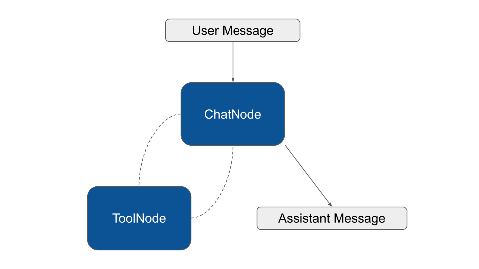

# Middleware

Middleware is a feature of the basic Workflow component. So you can attach custom middleware also to Agent and RAG to hook into their execution cycle.

### The Agent Workflow

The Agent class is an extension of the Workflow component. The Workflow is the foundational piece of the puzzle in Neuron. Many features of the Agent and RAG components inherit their logic from the capabilities of the underlying Workflow.

Here is a simple schema of the workflow used to create the agent implementation:

<figure><figcaption></figcaption></figure>

With this architecture in mind, you are free to use middleware to hook the  agent workflow, interruption to keep humans in the loop, or look below for a set of built-in components we provide for common use cases.

### Context Summarization

This middleware is designed to wrap the node where the agent actually call the LLM, to automatically summarize conversation history when approaching token limits. In Neuron there are three possible node in charge of this task based on the type of call you want to perform: `ChatNode`, `StreamingNode`, and `StructuredNode`. You should attach the middleware to all these nodes to be sure it works regardless of the mode the agent is running in.

```php
use NeuronAI\Agent\Agent;
use NeuronAI\Agent\Middleware\Summarization;
use NeuronAI\Agent\Nodes\InferenceNode;

class MyAgent extends Agent
{
    ...

    /**
     * Attach middleware to nodes.
     */
    protected function middleware(): array
    {
        return [
            InferenceNode::class => [
                new Summarization(
                    provider: $this->resolveProvider(), // Or use a dedicated provider instance
                    maxTokens: 10000,
                    messagesToKeep: 5,
                )
            ]
        ];
    }
}
```

`maxTokens` and `messagesToKeep` work together to define the threshold beyond which the summary must be performed. In the example above, if the context reach 30K tokens, there must be at least 10 messages in the chat history for the summary to start. Adding new messages to the chat history will eventually cross both thresholds triggering the summarization.

### Tool Search

By default every time the provider is invoked all tools are loaded and transmitted to the backend LLM. A complex production agent connected to email, calendar, drive, CRM, and and multiple MCP servers can easily reach hundreds of tools, each carrying its name, description, parameter schema, and usage hints.

This burns thousands of tokens on every turn, but the more painful issue is quality: when a model sees too many tools at once, descriptions blur together, similar-sounding tools compete for attention, and the agent starts making subtly wrong choices, mixing up parameters or hallucinating arguments because it is trying to keep too many signatures in working memory at the same time.

Tool search reframes the tool catalog as something the agent queries on demand rather than something it carries on every request.

You can use the global middleware `ToolSearchMiddleware` to activate dynamic tool selection on your agent:

```php
class MyAgent extends Agennt
{
    ...
    
    /**
     * Define the global middleware.
     */
    protected function globalMiddleware(): array
    {
        return [
            new ToolSearchMiddleware([
                MyCustomTool::make(),
                ...CalculatorToolkit::make()->tools()
                ...MCPConnector::make([...])->tools()
            ]),
        ];
    }
    
    /**
     * Provide core tools to the agent.
     */
    protected function tools(): array
    {
        return [
            // A list of core tools that the model always has available
            TavilySearchTool::make(...),
        ];
    }
}
```



The middleware automatically injects the `ToolSearch` tool in the default tool list available to the model on every request, and keep the list of tools you provide in an internal array.

The agent starts a turn with a minimal tool set, usually just `ToolSearch` itself plus whatever core tools you always want available, and when it needs a capability it does not currently have, it calls `ToolSearch` with a natural language query that returns a ranked list of tool descriptors with their full schemas. At this point a middleware sitting between the agent and the next inference call inspects the search result, extracts the tool identifiers, looks them up in the underlying registry, and adds their full definitions to the tools array that will be sent on the next request to the model.

From the model's perspective the next turn simply arrives with a richer tool list, and it can invoke any of those newly surfaced tools directly with proper schema validation, exactly as if they had been there from the start.
