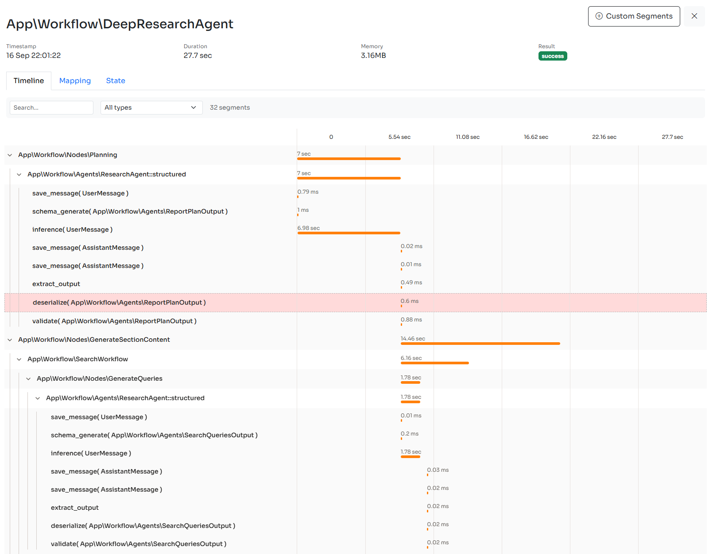

# Monitoring & Debugging

The [Inspector](https://inspector.dev/) team designed Neuron with built-in observability features, so you can monitor AI agents running, helping you maintain production-grade implementations with confidence.

## Install Inspector

You can follow this step-by-step guide to connect your Neuron AI Agents, RAG, or Workflow to the Inspector monitoring dashboard:



After connecting you app to Inspector when your agents are being executed, you will be able to explore the details of their inference steps, tool calls, and more.

<figure><figcaption></figcaption></figure>

If you want to monitor the whole application you can install the Inspector package based on your development environment. We provide integration packages for [PHP](https://github.com/inspector-apm/inspector-php), [Laravel](https://github.com/inspector-apm/inspector-laravel), [Symfony](https://github.com/inspector-apm/inspector-symfony), [CodeIgniter](https://github.com/inspector-apm/inspector-codeigniter), [Drupal](https://docs.inspector.dev/guides/drupal). Check out them on our [GitHub organization](https://github.com/inspector-apm).

### Create An Ingestion Key

To create an Ingestion key head to the [**Inspector dashboard**](https://app.inspector.dev/register) and create a new app.


For any additional support drop in a live chat in the dashboard. We are happy to listen from your experience, find new possible improvements, and make the tool better overtime.


### Inject InspectorObeserver

If your application doesn't have a specific integration with PHP environment variables, you can inject the InspectorObserver component into the agent programmatically, passing the ingestion key generated in the dashboard:

```php
use Inspector\Neuron\InspctorObserver;

/*
 * Inject at runtime
 */
$message = MyAgent::make()
    ->observe(InspctorObserver::instance('INSPECTOR_INGESTION_KEY'))
    ->chat(...)
    ->getMessage();
    
/*
 * Setup the observer once into the agent constructor
 */
class MyAgent extends Agent
{
    public function __construct()
    {
        $this->observe(InspctorObserver::instance('INSPECTOR_INGESTION_KEY'));
    }
}
```

## Logging

If you want to report agent activity into your log system you can attach the built-in `LogObserver` to your agent passing an instance of a PSR `LoggerInterface` compatible logger, like monolog for example:

```php
use NeuronAI\Observability\LogObserver;

$message = MyAgent::make()
    ->observe(new LogObserver($logger))
    ->chat(...)
    ->getMessage();
```

All itnernal events with their payload will be logged.
