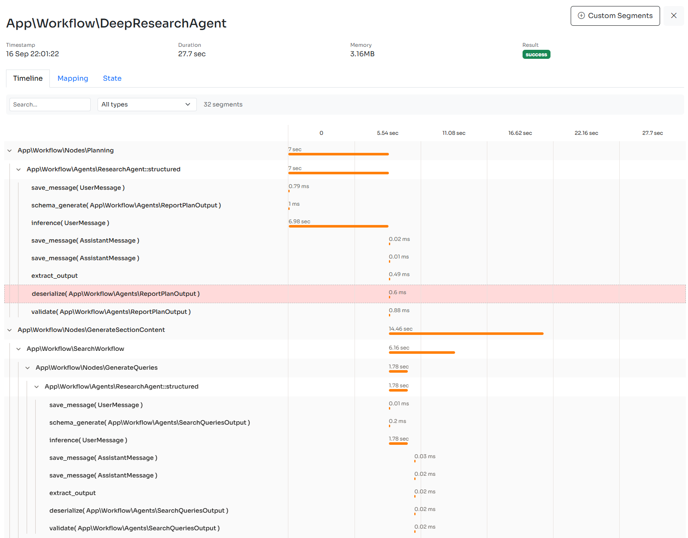

# Monitoring & Debugging

The [Inspector](https://inspector.dev/) team designed Neuron with built-in observability features, so you can monitor AI agents running, helping you maintain production-grade implementations with confidence.

### Subscribing Listeners

Listeners are class-keyed with instanceof matching — subscribe to a specific event class, or to `ObservabilityEvent::class` to receive everything:

```php
use NeuronAI\Observability\Events\InferenceStop;
use NeuronAI\Observability\ObservabilityEvent;

// React to one event type
$agent->subscribe(InferenceStop::class, function (InferenceStop $event): void {
    // do something...
});

// Catch-all events
$agent->subscribe(ObservabilityEvent::class, function (ObservabilityEvent $event): void {
    echo "Event: {$event->name()}\n";
    echo "Source: " . ($event->source !== null ? $event->source::class : 'n/a') . "\n";
});
```

#### Custom Events

Emit your own events from nodes with `Node::emit()` — the event object is the payload. Extends `ObservabilityEvent` :

```php
use NeuronAI\Observability\ObservabilityEvent;

class DocumentScored extends ObservabilityEvent
{
    public function __construct(public string $documentId, public float $score)
    {
    }
}

// Inside a node
$this->emit(new DocumentScored($doc->id, $score));

// Anywhere
$workflow->subscribe(DocumentScored::class, fn (DocumentScored $e) => $metrics->gauge('score', $e->score));
```

#### Integrating a Host Framework

Forward every event to an application-wide PSR-14 dispatcher (Symfony, Laravel's PSR bridge, League\Event) — Neuron events become regular application events:

```php
$agent->setEventDispatcher($appEventDispatcher);
```

### Install Inspector <a href="#install-inspector" id="install-inspector"></a>

Connect your Neuron AI Agents, RAG, or Workflow to the Inspector monitoring dashboard:



After connecting you app to Inspector when your agents are being executed, you will be able to explore the details of their inference steps, tool calls, and more.

<figure><figcaption></figcaption></figure>

If you want to monitor the whole application you can install the Inspector package based on your development environment. We provide integration packages for [PHP](https://github.com/inspector-apm/inspector-php), [Laravel](https://github.com/inspector-apm/inspector-laravel), [Symfony](https://github.com/inspector-apm/inspector-symfony), [CodeIgniter](https://github.com/inspector-apm/inspector-codeigniter), [Drupal](https://docs.inspector.dev/guides/drupal). Check out them on our [GitHub organization](https://github.com/inspector-apm).

### Create An Ingestion Key

To create an Ingestion key head to the [**Inspector dashboard**](https://app.inspector.dev/register) and create a new app.


For any additional support drop in a live chat in the dashboard. We are happy to listen from your experience, find new possible improvements, and make the tool better overtime.


### Register the Inspector Listener

If your application doesn't have a specific integration with PHP environment variables, you can inject the `InspectorListener` component into the agent programmatically, passing the ingestion key generated in the dashboard:

```php
use NeuronAI\Observability\InspctorObserver;

/*
 * Inject at runtime
 */
$message = MyAgent::make()
    ->subscribe(
        ObservabilityEvent::class, 
        InspctorObserver::instance('INSPECTOR_INGESTION_KEY')
    )
    ->chat(...)
    ->getMessage();
    
/*
 * Setup the listener once into the agent constructor
 */
class MyAgent extends Agent
{
    public function __construct()
    {
        parent::__construct();
        
        $this->subscribe(
            ObservabilityEvent::class, 
            InspctorObserver::instance('INSPECTOR_INGESTION_KEY')
        );
    }
}
```

## Logging

If you want to report agent activity into your log system you can attach the built-in `LogListener` to your agent passing an instance of a PSR `LoggerInterface` compatible logger, like monolog for example:

```php
use NeuronAI\Observability\LogListener;
use NeuronAI\Observability\ObservabilityEvent;

$message = MyAgent::make()
    ->subscribe(ObservabilityEvent::class, new LogListener($logger))
    ->chat(...)
    ->getMessage();
```

All itnernal events with their payload will be logged.
