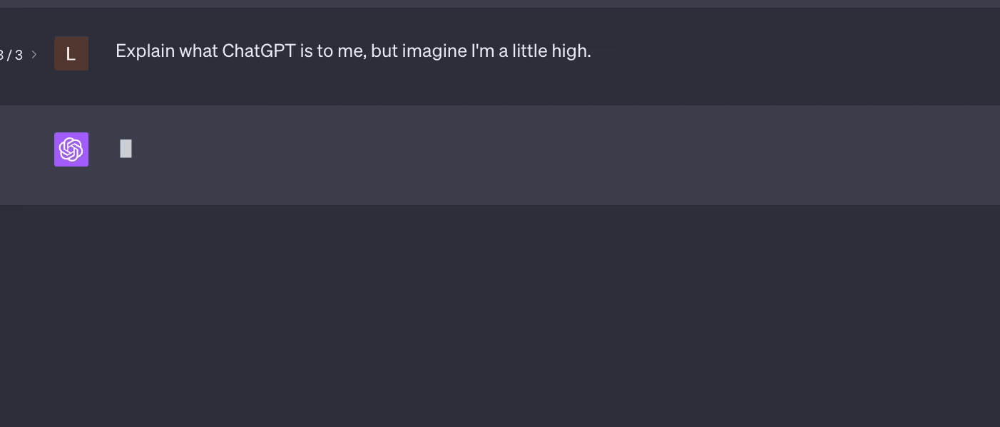

# Streaming

Streaming enables you to show users chunks of response text as they arrive rather than blindly waiting for the full response. You can offer a real-time Agent conversation experience.

<figure><figcaption></figcaption></figure>

### Agent

To stream the AI response you should use the `stream()` method on the agent, instead of `chat()`. This method prepares the agent workflow to use the `StreamingNode` instead of `ChatNode`.

Calling the `events()` method on the returning agent handler you get a PHP generator that can be used to consume the streamiong as an iterable object.

```php
use App\Neuron\MyAgent;
use NeuronAI\Chat\Messages\UserMessage;

$handler = MyAgent::make()->stream(new UserMessage('How are you?'));

// Print the response chunk-by-chunk in real-time
foreach ($handler->events() as $chunk) {
    echo $chunk->content;
}

// I'm fine, thank you! How can I assist you today?
```

### Streaming chunks

When you process the streamed response of the agent you can expect to receive three types of chunk objects:

* `TextChunk`: represents a piece of text
* `ReasoningChunk`: contains chunks of the reasoning summary of the model (only available for reasoning models)
* `ToolCallChunk`: represents the LLM asking for a tool execution
* `ToolResultChunk`: contains the results of tool execution

These objects are a layer of abstraction between the underlying messages flow inside the agent to perform a task and the data needed on the client side to stay informed on what's going on behind the scenes.

The stream composition depends by your agent implementation. If the agent has no tools attached there is no chance to receive a `ToolCallChunk` or `ToolResultChunk` instance, so you can iterate the output stream expecting only text and reasoning chunks.

### Streaming & Tools

Neuron support Tools & Function calls in combination with the streaming response. You are free to provide your Agents with Tools and they will be automatically handled in the middle of the stream, to continue toward the final response.

When the agent receive a tool call request from the LLM, it will stream two types of chunk: `ToolCallChunk`, `ToolResultChunk`.

These classes contain the instance of the tool behind called by the LLM so you can expose informative output to the client about what the agent is doind to answer the user prompt.

Here is an example of how you can deal with this scenario:

```php
use App\Neuron\MyAgent;
use NeuronAI\Chat\Messages\UserMessage;
use NeuronAI\Tools\Tool;

$handler = MyAgent::make()
    ->addTool(
        Tool::make(
            'get_server_configuration',
            'retrieve the server network configuration'
        )->addProperty(...)->setCallable(...)
    )
    ->stream(
        new UserMessage("What's the IP address of the server?")
    );

// Iterate chunks
foreach ($handler->events() as $chunk) {
    if ($chunk instanceof ToolCallChunk) {
        // Output the ongoing tool call
        echo "\n- Calling tool: ".$chunk->tool->getName();
        echo "\n- Input: ".json_encode($chunk->tool->getInputs());
        continue;
    }
    
    if ($chunk instanceof ToolResultChunk) {
        echo "\n- Tool ".$chunk->tool->getName()." completed";
        echo "\n- Result: ".$chunk->tool->getResult();
        continue;
    }
    
    // Handle TextChunk and ReasoningChunk
    echo $chunk->content;
}

// Let me retrieve the server configuration. 
// - Calling tool: get_server_configuration
// - Tool get_server_configuration completed
// The IP address of the server is: 192.168.0.10
```

### Get The Final Result

When the model finishes streaming output you can retrieve the final `AssistantMessage` instance with the `getMessage()` method on the workflow handler:

```php
$handler = MyAgent::make()->stream(...);

// Iterate chunks
foreach ($handler->events() as $chunk) {
    // ...
}

$message = $handler->getMessage(); // Get the final message instance
echo $message->getContent();
```

### Monitoring & Debugging

Many of the applications you build with Neuron will contain multiple steps with multiple invocations of LLM calls. As these applications get more and more complex, it becomes crucial to be able to inspect what exactly is going on inside your agentic system. The best way to do this is with [Inspector](https://inspector.dev/).



## Stream Adapters

Neuron's Stream Adapter system provides a flexible, protocol-agnostic way to help you easily integrate Neuron powered agents with your frontend stack.

Stream adapters act as translators between Neuron's internal streaming events (text chunks, tool calls, reasoning steps) and specific frontend protocols like Vercel AI SDK or AG-UI.

You can also plug in adapters to send streamed data to an external transport layer like [Pusher](https://pusher.com/), if you want to stream contents to the UI from agent executed in the background.

This architecture allows you to seamlessly integrate Neuron agents with various frontend frameworks without modifying your core agent logic. Adapters handle protocol-specific concerns such as message lifecycle events, event formatting, and ID tracking, while maintaining consistent streaming behavior across all providers (Anthropic, OpenAI, Gemini, Ollama, etc.). The system is highly extensible, you can create custom adapters by extending `SSEAdapter` to implement streaming data transofrmations, or directly implement the `StreamAdapterInterface` for custom needs.

<figure><figcaption></figcaption></figure>

You simply need to provide an adapter instance to the `events()` method of the agent handler used to stream the LLM response.

### AG-UI Adapter

Implements the streaming event-based protocol defined by AG-UI protocol for real-time agent-frontend interaction. Supports text messages, tool calls, reasoning, and lifecycle events.

For more information, visit: [https://docs.ag-ui.com/concepts/events](https://docs.ag-ui.com/concepts/events)

```php
use NeuronAI\Chat\Messages\Stream\Adapters\AGUIAdapter;

// Instruct the agent
$handler = MyAgent::make()
    ->stream(
        new UserMessage('What is the square root of 144?')
    );

// Provide the adapter instance to the events() method
$stream = $handler->events(new AGUIAdapter());

// Process the response
foreach ($stream as $line) {
    echo $line;
}
```

#### Connecting an AG-UI frontend

An AG-UI client (like CopilotKit) does not just open a connection. It sends a POST request with a JSON body called `RunAgentInput`, containing the conversation and the identifiers of the current run:

```json
{
  "threadId": "thread_123",
  "runId": "run_456",
  "messages": [
    {
      "id": "msg_1",
      "role": "user",
      "content": "What is the square root of 144?"
    }
  ],
  "tools": [],
  "state": {},
  "context": [],
  "forwardedProps": {}
}
```

Your endpoint should read this payload, map the messages to Neuron message objects, and pass `threadId` and `runId` to the adapter constructor. The adapter echoes them back in the `RUN_STARTED` and `RUN_FINISHED` events, so the client can correlate the stream with the run it requested. If you omit them, the adapter generates its own identifiers (useful for testing, but a real AG-UI frontend expects its own IDs back).

The adapter also provides the HTTP headers required by the SSE transport via the `getHeaders()` method. Remember to send them and to flush the output after each line, otherwise the stream can get stuck in PHP output buffers or proxies.

Here is a complete endpoint example:

```php
use NeuronAI\Chat\Messages\Stream\Adapters\AGUIAdapter;
use NeuronAI\Chat\Messages\UserMessage;

// Parse the AG-UI RunAgentInput payload
$input = json_decode(file_get_contents('php://input'), true);

$messages = [];
foreach ($input['messages'] as $message) {
    if ($message['role'] === 'user') {
        $messages[] = new UserMessage($message['content']);
    }
}

// Echo the client's thread and run identifiers back in the stream
$adapter = new AGUIAdapter(
    threadId: $input['threadId'],
    runId: $input['runId'],
);

// Send the SSE headers required by the protocol
foreach ($adapter->getHeaders() as $name => $value) {
    header("{$name}: {$value}");
}

$stream = MyAgent::make()->stream($messages)->events($adapter);

foreach ($stream as $line) {
    echo $line;
    flush();
}
```

#### Emitted events

The adapter translates Neuron streaming chunks into the following AG-UI events:

| Neuron chunk      | AG-UI events                                                                                                        |
| ----------------- | ------------------------------------------------------------------------------------------------------------------- |
| Run lifecycle     | `RUN_STARTED`, `RUN_FINISHED`                                                                                       |
| `TextChunk`       | `TEXT_MESSAGE_START`, `TEXT_MESSAGE_CONTENT`, `TEXT_MESSAGE_END`                                                    |
| `ReasoningChunk`  | `REASONING_START`, `REASONING_MESSAGE_START`, `REASONING_MESSAGE_CONTENT`, `REASONING_MESSAGE_END`, `REASONING_END` |
| `ToolCallChunk`   | `TOOL_CALL_START`, `TOOL_CALL_ARGS`, `TOOL_CALL_END`                                                                |
| `ToolResultChunk` | `TOOL_CALL_RESULT`                                                                                                  |

Tools attached to a Neuron agent are executed on the server. The client is informed of the ongoing execution through the `TOOL_CALL_*` events and receives the tool output in the `TOOL_CALL_RESULT` event, followed by the agent's final text message. The frontend-defined tools listed in the `tools` field of `RunAgentInput` (tools executed by the client) are not handled by the adapter.

The adapter does not emit the AG-UI shared state events (`STATE_SNAPSHOT`, `STATE_DELTA`, `MESSAGES_SNAPSHOT`), so state synchronization features of AG-UI clients are not available through this adapter.

### Vercel AI SDK Adapter

Adapter for Vercel AI SDK Data Stream Protocol: [https://ai-sdk.dev/docs/ai-sdk-ui/stream-protocol](https://ai-sdk.dev/docs/ai-sdk-ui/stream-protocol)

```php
use NeuronAI\Chat\Messages\Stream\Adapters\VercelAIAdapter;

// Instruct the agent
$handler = MyAgent::make()
    ->stream(
        new UserMessage('What is the square root of 144?')
    );

// Provide the adapter instance to the events() method
$stream = $handler->events(new VercelAIAdapter());

// Process the response
foreach ($stream as $line) {
    echo $line;
}
```

### Custom Adapters

The events() method of the agent handler accept an instance of StreamAdapterInterface. So you are free to implement this interface with custom implementation, and pass it to the handler. Here is how the interface looks like:

```php
interface StreamAdapterInterface
{
    /**
     * Transform a Neuron chunk into protocol-specific output.
     *
     * @param object $chunk Any Neuron chunk (TextChunk, ToolCallChunk, etc.)
     * @return iterable<string> One or more output lines/messages
     */
    public function transform(object $chunk): iterable;

    /**
     * Get HTTP headers for this protocol.
     *
     * @return array<string, string>
     */
    public function getHeaders(): array;

    /**
     * Protocol initialization sequence (optional).
     *
     * @return iterable<string>
     */
    public function start(): iterable;

    /**
     * Protocol termination sequence (optional).
     *
     * @return iterable<string>
     */
    public function end(): iterable;
}
```

You can always get inspiration by the built-in implementations.
