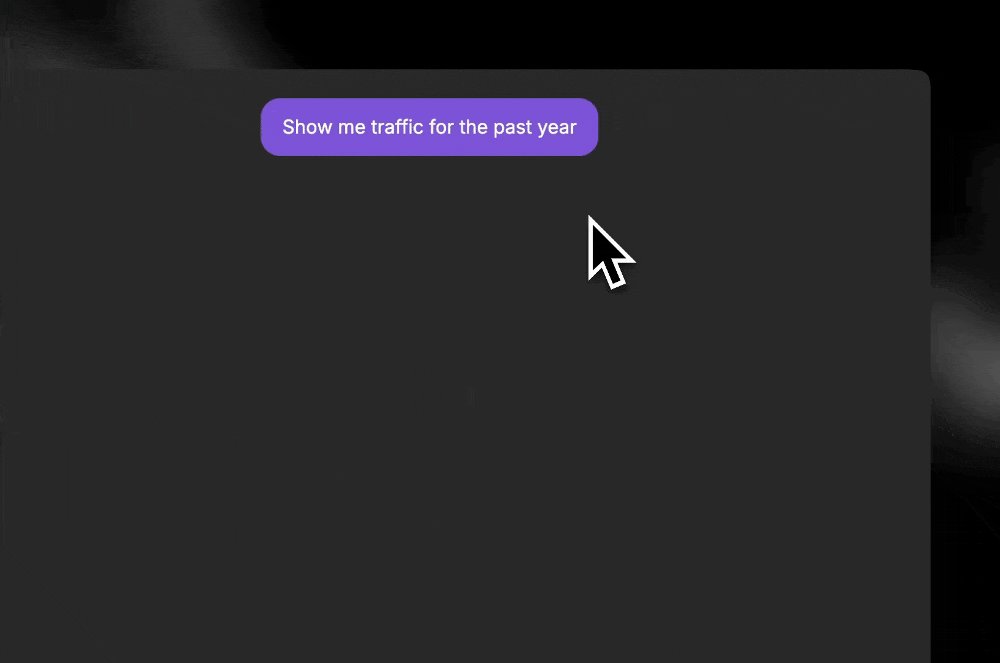
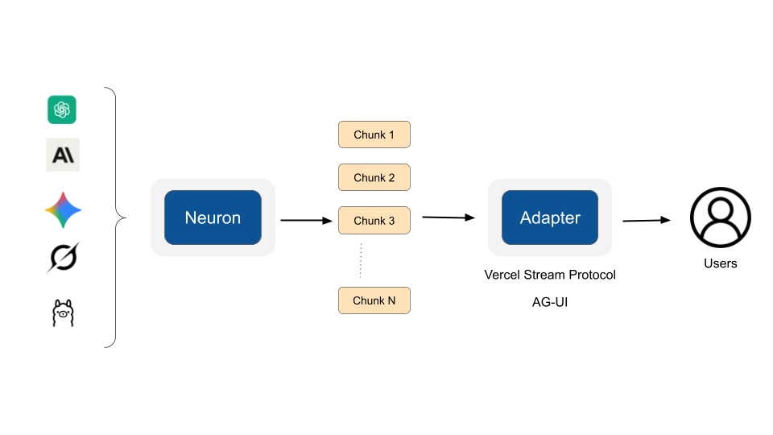

# Streaming

<figure><figcaption></figcaption></figure>


Use **`/neuron-streaming`** to teach your coding agent how to stream the agent response to the UI.

[AI-Assisted Development](../overview/agentic-development.md)


To stream the AI response you should use the `stream()` method on the agent, instead of `chat()`. This method prepares the agent workflow to use the `StreamingNode` instead of `ChatNode`.

Calling the `events()` method on the returning agent handler you get a PHP generator that can be used to consume the streamiong as an iterable object.

```php
use App\Neuron\MyAgent;
use NeuronAI\Chat\Messages\UserMessage;

$stream = MyAgent::make()
    ->setThreadId('chat_id')
    ->stream(new UserMessage('How are you?'));

// Print the response chunk-by-chunk in real-time
foreach ($stream as $chunk) {
    echo $chunk->content;
}

// I'm fine, thank you! How can I assist you today?
```

### Streaming chunks

When you process the streamed response of the agent you can expect to receive three types of chunk objects:

* `TextChunk`: represents a piece of text
* `ReasoningChunk`: contains chunks of the reasoning summary of the model (only available for reasoning models)
* `ToolCallChunk`: represents the LLM asking for a tool execution
* `ToolResultChunk`: contains the results of tool execution

These objects are a layer of abstraction between the underlying messages flow inside the agent to perform a task and the data needed on the client side to stay informed on what's going on behind the scenes.

The stream composition depends by your agent implementation. If the agent has no tools attached there is no chance to receive a `ToolCallChunk` or `ToolResultChunk` instance, so you can iterate the output stream expecting only text and reasoning chunks.

### Streaming & Tools

Neuron support Tools & Function calls in combination with the streaming response. You are free to provide your Agents with Tools and they will be automatically handled in the middle of the stream, to continue toward the final response.

When the agent receive a tool call request from the LLM, it will stream two types of chunk: `ToolCallChunk`, `ToolResultChunk`.

These classes contain the instance of the tool behind called by the LLM so you can expose informative output to the client about what the agent is doind to answer the user prompt.

Here is an example of how you can deal with this scenario:

```php
use App\Neuron\MyAgent;
use NeuronAI\Chat\Messages\UserMessage;
use NeuronAI\Tools\Tool;

$stream = MyAgent::make()
    ->setThreadId('chat_id')
    ->addTool(
        Tool::make(
            'get_server_configuration',
            'retrieve the server network configuration'
        )->addProperty(...)->setCallable(...)
    )
    ->stream(
        new UserMessage("What's the IP address of the server?")
    );

// Iterate chunks
foreach ($stream as $chunk) {
    if ($chunk instanceof ToolCallChunk) {
        // Output the ongoing tool call
        echo "\n- Calling tool: ".$chunk->tool->getName();
        echo "\n- Input: ".json_encode($chunk->tool->getInputs());
        continue;
    }
    
    if ($chunk instanceof ToolResultChunk) {
        echo "\n- Tool ".$chunk->tool->getName()." completed";
        echo "\n- Result: ".$chunk->tool->getResult();
        continue;
    }
    
    // Handle TextChunk and ReasoningChunk
    echo $chunk->content;
}

// Let me retrieve the server configuration. 
// - Calling tool: get_server_configuration
// - Tool get_server_configuration completed
// The IP address of the server is: 192.168.0.10
```

### Get The Final Result

When the model finishes streaming output you can retrieve the final `AssistantMessage` instance with the `getMessage()` method on the workflow handler:

```php
$stream = MyAgent::make()
    ->setThreadId('chat_id')
    ->stream(...);

// Iterate chunks
foreach ($stream as $chunk) {
    // ...
}

$message = $stream->getResult()->getMessage(); // Get the final message instance
echo $message->getContent();
```

### Monitoring & Debugging

Many of the applications you build with Neuron will contain multiple steps with multiple invocations of LLM calls. As these applications get more and more complex, it becomes crucial to be able to inspect what exactly is going on inside your agentic system. The best way to do this is with [Inspector](https://inspector.dev/)



## Stream Adapters

Neuron's Stream Adapter system provides a flexible, protocol-agnostic way to help you easily integrate Neuron powered agents with your frontend stack.

Stream adapters translate Neuron's internal streaming events (text chunks, tool calls, reasoning steps) into specific frontend protocols events like AG-UI.

This architecture allows you to seamlessly integrate Neuron agents with various frontend frameworks without modifying your core agent logic. Adapters handle protocol-specific concerns such as message lifecycle events, event formatting, and ID tracking, while maintaining consistent streaming behavior across all providers (Anthropic, OpenAI, Gemini, Ollama, etc.). The system is highly extensible, you can create custom adapters by extending `SSEAdapter` to implement streaming data transofrmations, or directly implement the `StreamAdapterInterface` for custom needs.

<figure><figcaption></figcaption></figure>

You simply need to provide an adapter instance to the `stream()` method of the agent used to stream the LLM response.

### Vercel AI SDK Adapter

Adapter for Vercel AI SDK Data Stream Protocol: [https://ai-sdk.dev/docs/ai-sdk-ui/stream-protocol](https://ai-sdk.dev/docs/ai-sdk-ui/stream-protocol)

```php
use NeuronAI\Chat\Messages\Stream\Adapters\VercelAIAdapter;

// Instruct the agent
$stream = MyAgent::make()
    ->setThreadId('chat_id')
    ->setStreamAdapter(new VercelAIAdapter())
    ->stream(
        new UserMessage('What is the square root of 144?')
    );

// Process the response
foreach ($stream as $line) {
    echo $line;
}
```

### AG-UI Adapter

Implements the streaming event-based protocol defined by AG-UI protocol for real-time agent-frontend interaction. Supports text messages, tool calls, reasoning, and lifecycle events.

For more information, visit: [https://docs.ag-ui.com/concepts/events](https://docs.ag-ui.com/concepts/events)

```php
use NeuronAI\Chat\Messages\Stream\Adapters\AGUIAdapter;

// Instruct the agent
$stream = MyAgent::make()
    ->setThreadId('chat_id')
    ->setStreamAdapter(new AGUIAdapter('chat_id'))
    ->stream(
        new UserMessage('What is the square root of 144?')
    );

// Process the response
foreach ($stream as $line) {
    echo $line;
}
```

#### Connecting an AG-UI frontend

An AG-UI client (like CopilotKit) does not just open a connection. It sends a POST request with a JSON body called `RunAgentInput`, containing the conversation and the identifiers of the current run:

```json
{
  "threadId": "thread_123",
  "runId": "run_456",
  "messages": [
    {
      "id": "msg_1",
      "role": "user",
      "content": "What is the square root of 144?"
    }
  ],
  "tools": [],
  "state": {},
  "context": [],
  "forwardedProps": {}
}
```

Your endpoint should read this payload, map the messages to Neuron message objects, and pass `threadId` and `runId` to the adapter constructor. The adapter echoes them back in the `RUN_STARTED` and `RUN_FINISHED` events, so the client can correlate the stream with the run it requested. If you omit them, the adapter generates its own identifiers (useful for testing, but a real AG-UI frontend expects its own IDs back).

The adapter also provides the HTTP headers required by the SSE transport via the `getHeaders()` method. Remember to send them and to flush the output after each line, otherwise the stream can get stuck in PHP output buffers or proxies.

Here is a complete endpoint example:

```php
use NeuronAI\Chat\Messages\Stream\Adapters\AGUIAdapter;
use NeuronAI\Chat\Messages\UserMessage;

// Parse the AG-UI RunAgentInput payload
$input = json_decode(file_get_contents('php://input'), true);

$messages = [];
foreach ($input['messages'] as $message) {
    if ($message['role'] === 'user') {
        $messages[] = new UserMessage($message['content']);
    }
}

// Echo the client's thread and run identifiers back in the stream
$adapter = new AGUIAdapter(
    threadId: $input['threadId'],
    runId: $input['runId'],
);

// Send the SSE headers required by the protocol
foreach ($adapter->getHeaders() as $name => $value) {
    header("{$name}: {$value}");
}

$stream = MyAgent::make()
    ->setStreamAdapter($adapter)
    ->stream($messages);

foreach ($stream as $line) {
    echo $line;
    flush();
}
```

The adapter translates Neuron streaming chunks into the following AG-UI events:

Tools attached to a Neuron agent are executed on the server. The client is informed of the ongoing execution through the `TOOL_CALL_*` events and receives the tool output in the `TOOL_CALL_RESULT` event, followed by the agent's final text message. The frontend-defined tools listed in the `tools` field of `RunAgentInput` (tools executed by the client) are not handled by the adapter.

The adapter does not emit the AG-UI shared state events (`STATE_SNAPSHOT`, `STATE_DELTA`, `MESSAGES_SNAPSHOT`), so state synchronization features of AG-UI clients are not available through this adapter.

### Custom Events

Both adapters understand portable step, activity, and custom events. AG-UI uses its native `STEP_STARTED`, `STEP_FINISHED`, `ACTIVITY_SNAPSHOT`, and `CUSTOM` events. Vercel emits transient `data-*` parts, so intermediate information is available to the UI without being added to assistant-message history.

Map an application event by its exact class when domain code should remain independent from Neuron's portable event objects:

```php
use NeuronAI\Chat\Messages\Stream\Adapters\Events\ActivityStreamEvent;
use NeuronAI\Chat\Messages\Stream\Adapters\VercelAIAdapter;

$adapter = (new AGUIAdapter())->mapEvent(
    IndexingProgress::class,
    static fn (IndexingProgress $event): ActivityStreamEvent =>
        new ActivityStreamEvent(
            id: $event->jobId,
            type: 'indexing',
            data: [
                'processed' => $event->processed,
                'total' => $event->total,
            ],
        ),
);
```

The callback returns a portable event, never SSE, JSON, or a protocol-specific array. Return `null` to suppress the explicitly mapped event. Mappings are exact class matches, so a parent-class mapping does not silently capture subclasses.

### Custom Adapters

The `stream()` method of the agent handler accept an instance of `StreamAdapterInterface`. So you are free to implement this interface with custom implementation, and pass it to the handler. Here is how the interface looks like:

```php
interface StreamAdapterInterface
{
    /**
     * Begin a run segment. The Workflow calls it before start() on every
     * segment, so one instance can serve a suspension and its continuation
     * in the same process: drop the previous segment's stream state, keep
     * the seeded protocol identity and snapshot.
     */
    public function reset(): void;
    
    /**
     * Transform a Neuron chunk into protocol events.
     *
     * @param object $chunk Neuron chunk (TextChunk, ToolCallChunk, etc.) or custom objects
     * @return iterable<ProtocolEvent> Zero or more events
     */
    public function transform(object $chunk): iterable;

    /**
     * Protocol initialization sequence (optional).
     *
     * @return iterable<ProtocolEvent>
     */
    public function start(): iterable;

    /**
     * Protocol termination sequence (optional).
     *
     * @return iterable<ProtocolEvent>
     */
    public function end(): iterable;

    /**
     * Protocol suspension sequence, consumed instead of end() when the run
     * pauses for external input.
     *
     * Adapters encode the active requests so the client learns what the run
     * is waiting for, including any termination frames. Return an empty
     * iterable if the protocol cannot express a pause.
     *
     * @param array<int, InterruptRequest> $requests The active requests, keyed by interrupt ID.
     * @return iterable<ProtocolEvent>
     */
    public function interrupt(array $requests): iterable;

    /**
     * Protocol failure sequence, consumed instead of end() when streaming fails.
     *
     * Adapters encode the original error for their protocol, including any
     * termination frames. Return an empty iterable if no failure output is needed.
     *
     * @return iterable<ProtocolEvent>
     */
    public function error(Throwable $error): iterable;
}
```

You can always get inspiration by the built-in implementations.

## Streaming Channels

As agents become more interactive and capable, application developers are increasingly forced to run them outside the HTTP request lifecycle because of its timeout limits, which leaves the streamed output with no way to reach the UI. Channels deliver the streamed output of Agents and Workflows to the user interface through external broadcast systems such as [Pusher](https://pusher.com/), websockets, a Redis queue, or whatever your application already uses.

### The problem it solves

There are two ways to run an Agent. You can consume its real-time events:

```php
foreach ($agent->events() as $event) {
    // handle each streamed item
}
```

or you can just ask for the final result:

```php
$state = $agent->setThreadId('chat_id')->chat(new UserMessage(...));
```

The first style works well when your application code holds the stream from start to finish, like a controller that keeps the HTTP connection open and prints every chunk to the browser.

The problem appears when nobody is holding the stream. Think about an Agent running in a background job. The job calls `events()`, the agent produces chunks, but there is no browser attached to that process. Without a Channel, all that output is simply thrown away.

Channels automatically forwards the streamed events to a custom transport: a websocket, a Redis queue, an SSE response, anything you want, in order to stream real-time results to your web app from a background process.

Remeber that a streaming adapter is required to use channels. If you want to forward the Neuron native chunks to the channel you can use the built-in `NeuronAI\Agent\Adapter\AgentChunkAdapter`.

### Attaching a channel

You attach a Channel implementing the `channel()` method in the Agent class, or using  `setChannel()` directly on the Agent instance.&#x20;

```php
use NeuronAI\Agent\Adapter\AgentChunkAdapter;
use NeuronAI\Workflow\Channel\CallbackChannel;
use NeuronAI\Workflow\Persistence\FilePersistence;

class MyAgent extends Agent
{
    ...
    
    protected function streamAdapter(): ?StreamAdapterInterface
    {
        // Or specialized UI protocols adapters
        return new AgentChunkAdapter();
    }
    
    protected function channel(): ?StreamingChannelInterface
    {
        return new PusherChannel(
            client: new Pusher(...),
            channel: 'PUSHER_CHANNEL_NAME'
        );
    }
}

// Run the agent
MyAgent::make()->stream(new UserMessage('Hi'));
```

### CallbackChannel

The fastest way to get started is `CallbackChannel`. It wraps up to four closures, one for each method of the interface. All of them are optional. Here is a complete example that publishes every streamed item to Redis, so a websocket server can forward it to the browser:

```php
use NeuronAI\Workflow\Channel\CallbackChannel;
use NeuronAI\Workflow\Persistence\FilePersistence;

$agent = MyAgent::make()
    ->setThreadId('chat_id')
    ->setChannel(new CallbackChannel(
        onSend: function (ProtocolEvent $item) use ($redis): void {
            $redis->publish('thread-123', serialize($item));
        },
    ));

$agent->stream(new UserMessage('Hi'));
```

Now it does not matter if `stream()` is called by a controller, a queue worker, or a cron job. The chunks always reach Redis, and from there your frontend.

You can also react to the terminal calls. This example notifies the frontend when the run pauses for approval, completes, or fails:

```php
use NeuronAI\Workflow\Channel\CallbackChannel;
use NeuronAI\Workflow\Interrupt\InterruptRequest;
use NeuronAI\Workflow\WorkflowState;

$channel = new CallbackChannel(
    onSend: fn (ProtocolEvent $item) => $redis->publish(
        'thread-123', 
        json_encode($item)
    ),
    onInterrupted: fn (InterruptRequest $request, string $runId) => $redis->publish(
        'thread-123',
        json_encode(['type' => 'interrupted', 'runId' => $runId])
    ),
    onCompleted: fn (WorkflowState $state, string $runId) => $redis->publish(
        'thread-123',
        json_encode(['type' => 'completed', 'runId' => $runId])
    ),
    onFailed: fn (\Throwable $e, string $runId) => $redis->publish(
        'thread-123',
        json_encode(['type' => 'failed', 'runId' => $runId, 'message' => $e->getMessage()])
    ),
);

MyAgent::make()
    ->setChannel($channel)
    ->stream(new UserMessage('Hi'));
```

### Pusher

You can stream the Agent output to the frontend via Pusher, or Pusher compatible servers.

```php
use NeuronAI\Agent\Adapter\AgentChunkAdapter;
use NeuronAI\Workflow\Streaming\Channel\PusherChannel;
use NeuronAI\Workflow\Streaming\Channel\StreamingChannelInterface;
use Pusher\Pusher;

class MyAgent extends Agent
{
    ...
    
    protected function streamAdapter(): ?StreamAdapterInterface
    {
        // Or specialized UI protocol adapters
        return new AgentChunkAdapter();
    }
    
    protected function channel(): StreamingChannelInterface
    {
        return new PusherChannel(
            client: new Pusher(...),
            channel: 'PUSHER_CHANNEL_NAME',
            maxRequestBytes: 10_000,
            batchSize: 10
        );
    }
}
```

**`maxRequestBytes`** allows you to adjust the component compatibility with Pusher compatible servers. Its default value of 10 KB is good for Pusher but other servers could support a different request size.

**`batchSize`** instead allows you to define how many events must be collected before sending them in a single batch request. Higher values make the backend execution smoothly but can result in a scattered frontend experience. Lower values makes the frontend experience smoothly running more sending requests on the backend side.


Use **`/neuron-streaming`** skill or framework specific skills **`/neuron-laravel-integration`** , **`/neuron-symfony-integration`** to give your agent accurate instructions for this integration.


#### Partial Events

Pusher caps an event at 10 KB; Reverb defaults to the same, Soketi to 100 KB, and `maxRequestBytes` (default `10_000`) tunes the ceiling.&#x20;

To support streaming when your real-time server has such a limit, an event that does not fit the max size - typically a tool call, tool result, or a message snapshot - is split into consecutive fragments. Furthermore servers do not guarantee that fragments arrive in order and never interleave. So the browser must be able to reconcile this fragmentation and ordering in order to deliver consistent streaming to your UI components.

Neuron ships with a first-party Typescript module that brings this capability into your frontend.

Install the module with:

```shellscript
npm install @neuron-core/streaming
```

Check out the dedicated documentation to integrate it in your frontend: [https://www.npmjs.com/package/@neuron-core/streaming](https://www.npmjs.com/package/@neuron-core/streaming)

### Mercure

You can stream the agent output to a Mercure Hub using SSE:

```php
use NeuronAI\Agent\Adapter\AgentChunkAdapter;
use NeuronAI\Workflow\Streaming\Channel\PusherChannel;
use NeuronAI\Workflow\Streaming\Channel\StreamingChannelInterface;
use Pusher\Pusher;

class MyAgent extends Agent
{
    ...
    
    protected function streamAdapter(): ?StreamAdapterInterface
    {
        // Or specialized UI protocol adapters
        return new AgentChunkAdapter();
    }
    
    protected function channel(): StreamingChannelInterface
    {
        return new MercureChannel(
            hub: new Hub(...),
            topic: 'thread:'.$this->getThreadId(),
            maxRequestBytes: 1_048_576,
            maxRequestsPerSecond: null,
            private: true
        );
    }
}
```

By default `maxRequestsPerSecond` is set to null, because self hosted instances doesn't have any rate-limit. If you use a managed cloud instance, they impose strict rate limits from one up to twenty requests per second based on your subscription plan.

Once you configure the MercureChannel with the same restriction you have on the Mercure server the component automatically limits the pace of which it sends events, and eventually it split the event in multiple fragments if the size is over `maxRequestBytes` . The browser must be able to reconcile this fragmentation and ordering in order to deliver consistent streaming to your UI components.

Neuron ships with a first-party Typescript module that brings this capability into your frontend.

Install the module with:

```shellscript
npm install @neuron-core/streaming
```

Check out the dedicated documentation to integrate it in your frontend: [https://www.npmjs.com/package/@neuron-core/streaming](https://www.npmjs.com/package/@neuron-core/streaming)


Use **`/neuron-streaming`** skill or framework specific skills **`/neuron-laravel-integration`** , **`/neuron-symfony-integration`** to give your agent accurate instructions for this integration.


### Redis

`RedisChannel` publishes the segment on a Redis Pub/Sub channel, the usual fan-out between a worker running the agent and the process holding the client's connection (an SSE endpoint, a websocket server). It needs `ext-redis` and a connected `Redis` client.

```php
use NeuronAI\Agent\Adapter\AgentChunkAdapter;
use NeuronAI\Workflow\Streaming\Channel\RedisChannel;
use NeuronAI\Workflow\Streaming\Channel\StreamingChannelInterface;
use Redis;

class MyAgent extends Agent
{
    ...
    
    protected function streamAdapter(): ?StreamAdapterInterface
    {
        return new AGUIAdapter($this->getThreadId());
    }
    
    protected function channel(): StreamingChannelInterface
    {
        return new RedisChannel(
            client: new Redis(...), 
            channel: "chat:{$threadId}",
        );
    }
}
```

#### Redis consumer

With channels your agent  sends streamed chunks to the specified redis queue. So now your app need a way to listen for these chunks and forward the stream to the frontend.&#x20;

`RedisChannelReader` reads what `RedisChannel` publishes. An agent that started before it subscribed, raises `ChannelReadException`, as does silence past its timeout. Redis delivers one publisher's messages in order and `RedisChannel` never fragments, so it needs no reordering or reassembly.

```php
(new RedisChannelReader(new Redis(...), 'chat:{$threadId}'))
    ->listen(function (ProtocolEvent $event): void {
        echo SSEEncoder::frame($event);
        if (ob_get_level() > 0) {
            ob_flush();
        }
        flush();
    });
```


Use **`/neuron-streaming`** skill or framework specific skills **`/neuron-laravel-integration`** , **`/neuron-symfony-integration`** to give your agent accurate instructions for this integration.


### Channel errors never break the run

A Channel talks to external systems, and external systems fail. A Redis server can be down, a socket can be closed. The framework protects the run from this: every call to the Channel is guarded. If your Channel throws an exception, the workflow catches it, reports it as a `ChannelError` event through the observability system, and continues the run as if nothing happened.

This means the AI work is never lost because a delivery transport had a problem. The chat history remains the source of truth. The live stream is only a convenience on top of it, and a client that missed some chunks can always reload the final result from history.

If your transport needs a real policy for repeated failures, for example stop trying after ten errors, put that logic inside your Channel implementation, because only the Channel knows what a failure means for its own transport.

### Custom Channels

A Channel is any class that implements `ChannelInterface`. It has four methods. One receives the streamed items, and three tell you how the run ended:

```php
namespace NeuronAI\Workflow\Channel;

interface StreamingChannelInterface
{
    /** 
     * A protocol event produced by the stream adapter, in stream order. 
     */
    public function send(ProtocolEvent $event): void;

    /**
     * Run segment ended with one or more active interrupt requests.
     */
    public function interrupted(WorkflowState $state): void;

    /** Run segment ended cleanly. */
    public function completed(WorkflowState $state, string $workflowId): void;

    /**
     * Run segment died on an unhandled throwable. Notification only — the
     * exception propagates to the caller regardless.
     */
    public function failed(Throwable $exception, string $workflowId): void;
}
```

Every run ends with exactly one of the three terminal calls: `suspended()`, `completed()`, or `failed()`. This is important for user interfaces. If a run fails and you have no error signal, the user is left with a spinner that never stops. With `failed()` your frontend always receives a clear end signal and can recover, for example by reloading the chat history.

Two details are good to know. The `failed()` method is a notification only: the exception still reaches the code that called `chat()`.&#x20;

Here is an example of a `LogChannel`:

```php
use NeuronAI\Workflow\Channel\ChannelInterface;
use NeuronAI\Workflow\Interrupt\InterruptRequest;
use NeuronAI\Workflow\WorkflowState;

class LogChannel implements ChannelInterface
{
    public function __construct(protected LoggerInterface $log)
    {
    }

    public function send(ProtocolEvent $item): void
    {
        $this->log->debug(json_encode($item));
    }

    public function interrupted(InterruptRequest $request, string $runId): void
    {
        $this->log->debug("interrupted: {$runId}");
    }

    public function completed(WorkflowState $state, string $runId): void
    {
        $this->log->debug("completed: {$runId}");
    }

    public function failed(Throwable $exception, string $runId): void
    {
        $this->log->debug("failed: {$runId} ({$exception->getMessage()})");
    }
}
```

And attach it like any other channel:

```php
$agent->setChannel(new LogChannel(new Logger(__DIR__ . '/storage/workflow.log')));
```
