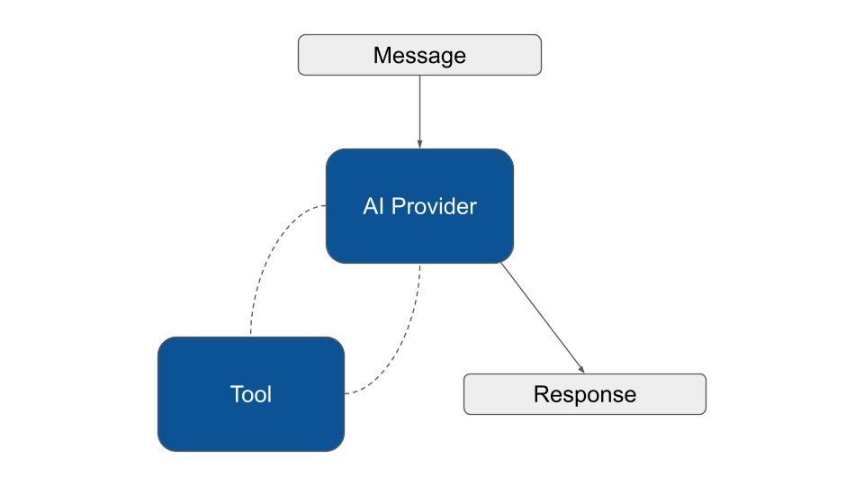
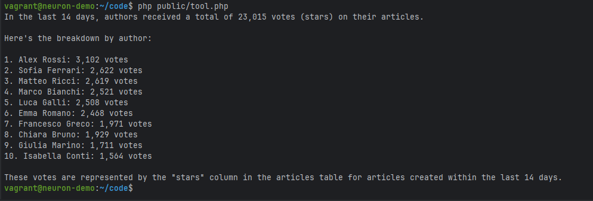

# Tools & Toolkits


#### Coding Agent Skill

&#x20;**`/neuron-tool`** to teach your coding agent how to implement custom tools and use them in your agent class.

[AI-Assisted Development](../overview/agentic-development.md)


The core agent loop involves calling a model, letting it choose tools to execute, and then finishing when no more tools are needed to provide a response:

<figure><figcaption></figcaption></figure>

### What is a Tool

Tools enable Agents to go beyond generating text by facilitating interaction with your application services, or external APIs.

Think about Tools as special functions that your AI agent can use when it needs to perform specific tasks. They let you extend your Agent's capabilities by giving it access to specific functions it can call inside your code.



In the [YouTubeAgent](agent.md) example we can define a tool to make the Agent able to retrieve the YouTube video transcription, so it can crteate a short summary:

```php
namespace App\Neuron;

use NeuronAI\Agent\Agent;
use NeuronAI\Agent\SystemPrompt;
use NeuronAI\Providers\AIProviderInterface;
use NeuronAI\Providers\Anthropic\Anthropic;
use NeuronAI\Tools\PropertyType;
use NeuronAI\Tools\Tool;
use NeuronAI\Tools\ToolProperty;

class YouTubeAgent extends Agent
{
    protected function provider(): AIProviderInterface
    {
        // return an AI provider instance (Anthropic, OpenAI, Ollama, Gemini, etc.)
        return new Anthropic(
            key: 'ANTHROPIC_API_KEY',
            model: 'ANTHROPIC_MODEL',
        );
    }
    
    protected function instructions(): string 
    {
        return new SystemMessage(<<<TEXT
            You are an AI Agent specialized in writing YouTube video summaries.
            Get the url of a YouTube video, or ask the user to provide one.
            Use the tools you have available to retrieve the transcription of the video.
            Write a summary in a paragraph without using lists. Use just fluent text.
            After the summary add a list of three sentences as the three most important take away from the video.
        TEXT);
    }
    
    protected function tools(): array
    {
        return [
            GetTranscriptionTool::make('API_KEY'),
        ];
    }
}

```

We introduced the new method `tools()` into the Agent class. This method expects to return an array of Tools that the AI can use if needed to complete tasks.

Neuron provides you with these clear and simple APIs and automates all the underlying interactions with the LLM. You can connect basically everything you want to the Agent. Being able to execute local functions allows you to invoke any external APIs or application components and let the Agent performs real action on your environment.

### Create Tools

Tools are components that extends the `Tool`  class. You are free to create pre-packaged tools to make the agent able to perform actions.

To create a new Tool run the console command below:



```bash
vendor/bin/neuron make:tool App\\Neuron\\GetTranscriptionTool
```



```powershell
.\vendor\bin\neuron make:tool App\Neuron\GetTranscriptionTool
```



You can customize the scaffolding of the tool with the code below:

```php
<?php

namespace App\Neuron\Tools;

use GuzzleHttp\Client;
use NeuronAI\Tools\PropertyType;
use NeuronAI\Tools\Tool;
use NeuronAI\Tools\ToolOutput;
use NeuronAI\Tools\ToolProperty;

class GetTranscriptionTool extends Tool
{
    protected string $name = 'get_transcription';
    
    protected ?string $description = 'Retrieve the transcription of a youtube video.';
    
    protected Client $client;
    
    public function __construct(protected string $key)
    {
    }
    
    /**
     * Return the list of properties.
     */
    protected function properties(): array
    {
        return [
            new ToolProperty(
                name: 'video_url',
                type: PropertyType::STRING,
                description: 'The URL of the YouTube video.',
                required: true
            )
        ];
    }
    
    /**
     * Implementing the tool logic
     */
    public function __invoke(string $video_url): ToolOutput
    {
        $response = $this->getClient()
            ->get('transcript?url=' . $video_url.'&text=true')
            ->getBody()
            ->getContents();

        $response = json_decode($response, true);

        return ToolOutput::text($response['content']);
    }
    
    protected function getClient(): Client
    {
        return $this->client ??= new Client([
            'base_uri' => 'https://api.supadata.ai/v1/youtube/',
            'headers' => [
                'x-api-key' => $this->key,
            ]
        ]);
    }
}
```

**Tool name and description**: These are the information that the LLM uses to decide when and why the tool should be used. Prompt engineering can help to instruct the model take better decisions.

**The properties method**: Implement this method to return the list of properties the tool expects.

**The `__invoke` method**: Here you need to implement the logic of the tool, and return a result that will be returned back to the model.

Notice how the `__invoke()` method accepts the same arguments defined by the `ToolProperty` with the same name and data type.

Once implemented, you can list the tool in the array returned by the tools method.

```php
<?php

namespace App\Neuron;

use NeuronAI\Agent;
use NeuronAI\Providers\AIProviderInterface;
use App\Neuron\Tools\GetTranscriptionTool;

class YouTubeAgent extends Agent
{
    protected function provider(): AIProviderInterface
    {...}
    
    protected function instructions(): string
    {...}
    
    protected function tools(): array
    {
        return [
            GetTranscriptionTool::make('API_KEY'),
        ];
    }
}
```

`GetTranscriptionTool` is just an example. You can eventually implement other tools to make the Agent able to retrieve other video metadata to enhance its video analysis capabilities.

Finally you can talk to the agent asking for the summary of a YouTube video.

```php
use NeuronAI\Chat\Messages\UserMessage;

$message = YouTubeAgent::make($user)
    ->setThreadId('chat_id')
    ->chat(
        new UserMessage('What about this video: https://www.youtube.com/watch?v=WmVLcj-XKnM')
    )
    ->getMessage();
    
echo $message->getContent();

/**

Based on the transcription, I'll provide a summary of this powerful environmental 
message from "Mother Nature":
This video presents ...

Three most important takeaways:

1. Nature has existed ...

2. The wellbeing of humanity is ...

3. How humans choose to act toward Nature determines ...

*/
```

### Max Runs

Agents have a safety mechanism that tracks the number of times a tool is invoked during an execution session. If the agent exceeds this limit, execution is interrupted and the `ToolRunsExceededException` is thrown. By default the limit is 10 calls, and it count for each tool individually.

You can customize this value with the `toolMaxRuns()` method at agent level, or use `setMaxRuns()` on the tool level. **Setting max tries on single tool takes precedence over the global setting**.

```php
try {

    $response = YouTubeAgent::make()
        ->setThreadId('chat_id')
        ->toolMaxRuns(5) // Max number of calls for each tool
        ->addTool(
            // Tool level config takes precedence over the global setting
            CustomTool::make()->setMaxRuns(2)
        )
        ->chat(...)
        ->getMessage();
        
} catch (ToolMaxTriesException $exception) {
    // do something
}
```

By default, tool runs are tracked by the tool name. You can customize this key implementing `getRunKey()`  in the tool class:

```php
class GetTranscriptionTool extends Tool
{
    ...
    
    public function getRunKey(): string
    {
        return $this->getName() . ':' . hash('sha1', json_encode($this->getInputs()));
    }
}
```

In the previous example, we also track tool runs based on input parameters, so the same tool, called with different inputs, will be counted on separate keys. For this specific use case you can use the built-in trait `NeuronAI\Tools\TrackByInputs` that already implement parameters-aware run tracking:

```php
use NeuronAI\Tools\TrackByInputs;

class GetTranscriptionTool extends Tool
{
    use TrackByInputs;
    
    ...
}
```

### Visibility

You can condition the availability of tools based on custom rules. The Tool class provides you with the `visible` method to determine if the agent should even known this tool exists:

```php
class YouTubeAgent extends Agent
{
    ...
    
    protected function tools(): array
    {
        return [
            GetTranscriptionTool::make('API_KEY')->visible(
                auth()->user()->can(...)
            ),
        ];
    }
}
```

If the `visible` method get `false`, the tool will not be available during agent execution.

### Multimodal Tool Output

By default a tool returns a string (or an array, which is JSON-encoded). When your tool needs to send richer content back to the model like images, documents, audio, video, return a `ToolOutput` instance from `__invoke()` instead. It wraps a list of content blocks that providers supporting multimodal tool results (like Anthropic) map natively to their API; text-only providers automatically fall back to the concatenated text blocks. This works on every tool out of the box.

```php
use NeuronAI\Chat\Enums\MediaType;
use NeuronAI\Chat\Enums\SourceType;
use NeuronAI\Chat\Messages\ContentBlocks\ImageContent;
use NeuronAI\Chat\Messages\ContentBlocks\TextContent;
use NeuronAI\Tools\ToolOutput;

class PriceChartTool extends Tool
{
    ...

    public function __invoke(string $symbol): ToolOutput
    {
        $base64 = $this->renderChart($symbol);

        return new ToolOutput([
            new TextContent("Price chart for {$symbol}"),
            new ImageContent($base64, SourceType::BASE64, MediaType::PNG),
        ]);
    }
}
```

For single-block outputs you can use the shortcut constructors: `ToolOutput::text(...)`, `ToolOutput::image(...)`, `ToolOutput::file(...)`, `ToolOutput::audio(...)`, `ToolOutput::video(...)`.

> Include a `TextContent` block in outputs meant to work across all providers: text-only providers see only the text blocks, so an image-only output would reach them empty.

### Tool Approval

Neuron provides you with full support for the human in the loop patterns including tool approval. The framework intercepts the tool call and pause, waiting for the user's final decision.&#x20;

Just override the `approvalPolicy()` method on the Tool class to determine whether the tool shuold be gated for approval. The method will receive the inputs the model want to use to call the tool. Returning a string counts as true and doubles as the approval request reason.

```php
class BuyTicketTool extends Tool
{
    ...,
    
    protected function approvalPolicy(array $inputs): bool|string
    {
        // The tool requires approval if the amount is greather than 100
        return $inputs['amount'] > 100;
    }
}
```

Check out the dedicated section to understand how to manage the full approval flow: [Tool Approval](tool-approval.md)

### Tool Search

By default every time the provider is invoked all tools are loaded and transmitted to the backend LLM. A complex production agent connected to email, calendar, drive, CRM, and and multiple MCP servers can easily reach hundreds of tools, each carrying its name, description, parameter schema, and usage hints.

Tool search reframes the tool catalog as something the agent queries on demand rather than something it carries on every request.


[middleware.md](middleware.md)




### Monitoring & Debugging

Many of the applications you build with Neuron will contain multiple steps with multiple invocations of LLM calls. As these applications get more and more complex, it becomes crucial to be able to inspect what exactly is going on inside your agentic system. The best way to do this is with [Inspector](https://inspector.dev/).



## Tool Properties

Neuron allows you to define the format of the data you want to receive into the tool function. You can nest these objects inside each other to define complex data structures.

### ToolProperty

This class represent a simple scalar value like string, int, or boolean.

```php
namespace App\Neuron\Tools;

use NeuronAI\Tools\PropertyType;
use NeuronAI\Tools\Tool;
use NeuronAI\Tools\ToolProperty;

class MyTool extends Tool
{
    public function __construct(){...}
	
    protected function properties(): array
    {
        return [
            new ToolProperty(
                name: 'arg',
                type: PropertyType::STRING,
                description: 'Describe the value you expect',
                required: true
            )
        ];
    }
    
    public function __invoke(string $arg): ToolOutput 
    {
        ...
    }
}
```

### ArrayProperty

The `ArrayProperty` allows you to require a list of items with specific characteristics.

Use the argument `items` to specify the data type of the array elements. In the example below we ask for an array of string.

```php
namespace App\Neuron\Tools;

use NeuronAI\Tools\PropertyType;
use NeuronAI\Tools\Tool;
use NeuronAI\Tools\ArrayProperty;
use NeuronAI\Tools\ToolProperty;

class MyTool extends Tool
{
    public function __construct(){...}
	
    protected function properties(): array
    {
        return [
            new ArrayProperty(
                name: 'prop_array',
                description: 'Describe the value you expect',
                required: true,
                items: new ToolProperty(
                    name: 'prop',
                    type: PropertyType::STRING,
                    description: 'Describe the value you expect',
                    required: true
                )
            )
        ];
    }
    
    public function __invoke(string $arg): ToolOutput
    {
        ...
    }
}
```

#### Max and Min limits

The ArrayProperty allows you also to define limitations about the size of the expected array using `minItems` and `maxItems` arguments.

```php
$property = new ArrayProperty(
    name: "tags",
    description: "List of tags associated with the item",
    required: true,
    items: new ToolProperty(
        name: "tag",
        type: PropertyType::STRING,
        description: "A single tag",
        required: true
    ),
    minItems: 1,
    maxItems: 10
);
```

### ObjectProperty

Similar to the array example above you can define an object data structure:

```php
namespace App\Neuron\Tools;

use NeuronAI\Tools\PropertyType;
use NeuronAI\Tools\Tool;
use NeuronAI\Tools\ObjectProperty;
use NeuronAI\Tools\ToolProperty;

class MyTool extends Tool
{
    public function __construct(){...}
	
    protected function properties(): array
    {
        return [
            new ObjectProperty(
                name: 'colors',
                description: 'RGB color',
                required: true,
                properties: [
                    new ToolProperty(
                        name: 'r',
                        type: PropertyType::NUMBER,
                        description: 'The red part of the RGB',
                        required: true
                    ),
                    new ToolProperty(
                        name: 'g',
                        type: PropertyType::NUMBER,
                        description: 'The green part of the RGB',
                        required: true
                    ),
                    new ToolProperty(
                        name: 'b',
                        type: PropertyType::NUMBER,
                        description: 'The blue part of the RGB',
                        required: true
                    )
                ]
            )
        ];
    }
    
    public function __invoke(string $arg): ToolOutput
    {
        ...
    }
}
```

### Structured Tool Input

If the obect you want has many properties you can pass a structured PHP class to the `ObjectProperty` instead of defining the schema manually. Neuron will provide you with an instance of this class as the input argument of the tool function:

```php
namespace App\Neuron\Tools;

use App\Neuron\Dto\Color;
use NeuronAI\Tools\PropertyType;
use NeuronAI\Tools\Tool;
use NeuronAI\Tools\ToolProperty;

class MyTool extends Tool
{
    public function __construct(){...}
	
    protected function properties(): array
    {
        return [
            new ObjectProperty(
                name: 'color',
                description: 'Combination of colors',
                required: true,
                class: Color::class
            )
        ];
    }
    
    public function __invoke(Color $color): ToolOutput
    {
        ...
    }
}
```

Here is how the Colors class looks like:

```php
<?php

namespace App\Neuron\Dto;

use NeuronAI\StructuredOutput\SchemaProperty;

class Color
{
    #[SchemaProperty(description: "The RED part of the RGB", required: true)]
    public float $r;
    
    #[SchemaProperty(description: "The GREEN part of the RGB", required: true)]
    public float $g;
    
    #[SchemaProperty(description: "The BLUE part of the RGB", required: true)]
    public float $b;
}
```

## ProviderTool

Some providers offer the possibility to use their built-in tools like web\_search, file\_search, and others instead of relying on external services. Even they offer this service they introduce a lot of constraints using these tools. The most flexible and reliable way to add cpabailities to your agents remains the Tools and Toolkit systems.

You can add a provider tool as usual in the tools array of your agent:

```php
use NeuronAI\Tools\ProviderTool;

class MyAgent extends Agent
{
    protected function provider(): AIProviderInterface
    {
        return new OpenAIResponses(
            key: 'OPENAI_API_KEY',
            model: 'OPENAI_MODEL',
        );
    }

    protected function tools(): array
    {
        return [
            ProviderTool:make(
                type: 'web_search'
            )->setOptions([...]),
        ];
    }
}
```

Currently only [OpenAIResponses](../providers/ai-provider.md#openairesponses), [Gemini](../providers/ai-provider.md#gemini), and [Anthropic](../providers/ai-provider.md#anthropic) support these tools.

## FrontendTool

Until now a tool was a single thing: a representation of a PHP function the model can ask to run and the backend executes. `FrontendTool` allows you to define tools that will be executed by the frontend of your application. Once completed the frontend send back the result of the tool execution, and Neuron will provide this result to the model continuing the loop.

This is how backend agents can access the browser APIs, or the device capabailities in a mobile app, transparently.

`FrontendTool` makes this a first-class concept in Neuron. The model sees it and can call it, but the backend never executes it. When the model calls a frontend tool, the agent suspends the run, hands the pending calls to you, and continues from exactly that point once you submit the results.

The framework ships with built-in integration for AG-UI with [CopilotKit](https://docs.copilotkit.ai/frontend-tools), and [Vercel AI SDK](https://ai-sdk.dev/docs/foundations/tools#provider-defined-tools).

### How it works

A `FrontendTool` is constructed from a name, an optional description, and an optional JSON Schema describing its inputs. It has no `__invoke()`; so a frontend tool can never run on the server.

When the model returns a batch of tool calls, the agent splits the batch:

1. **Approval first.** Any call whose tool requires approval suspends the run with an `ApprovalRequest`, exactly as for local tools. See [tool approval](tools.md#tool-approval).
2. **Local tools execute** on the backend as usual.
3. **Deferred calls suspend the run** with a `ToolResultsRequest`. The request carries the pending `ToolCall` objects (name, call ID, inputs) so you can dispatch them to the frontend.


We recommend to use **`/neuron-frontend-integration`** skill in your coding assistant to better understand the complete flow and the implementation details.


To continue, submit the results keyed by call ID through `Agent::submitInputs()` with a `ToolResultsTranslator`. Once every deferred call has a result, the agent writes the tool results to chat history and runs the next inference.

### Registering a FrontendTool

```php
use NeuronAI\Tools\FrontendTool;

$readTitle = new FrontendTool(
    name: 'read_page_title',
    description: 'Read the title of the page the user is currently looking at.'
);

$readText = new FrontendTool(
    name: 'read_element_text',
    description: 'Read the text content of an element on the page.',
    inputSchema: [
        'type' => 'object',
        'properties' => [
            'selector' => ['type' => 'string', 'description' => 'CSS selector of the element'],
        ],
        'required' => ['selector'],
    ]
);

$agent = Agent::make()
    ->setAiProvider($provider)
    ->setChatHistory(new SQLChatHistory($pdo, $threadId))
    ->setPersistence(new DatabasePersistence($pdo))
    ->addTool([$readTitle, $readText, new SearchDocsTool()]);
```

Without a schema, a deferred tool behaves like any other tool: you can add properties with `addProperty()` or override `properties()` in a subclass. A frontend tool can also require approval with `requireApproval()` as any other tool.

### Suspending and resuming with results

```php
use NeuronAI\Agent\Interrupt\ToolResultsRequest;
use NeuronAI\Agent\Interrupt\ToolResultsTranslator;
use NeuronAI\Chat\Messages\UserMessage;

// Request 1: the model decides to read the page.
$state = $agent->chat(new UserMessage('What is this page about?'));

if ($state->isInterrupted()) {
    $request = $state->getInterruptRequest();

    if ($request instanceof ToolResultsRequest) {
        foreach ($request->getToolCalls() as $call) {
            // Send $call->getName(), $call->getCallId() and $call->getInputs()
            // to the client that will execute them.
        }
    }
}

// Request 2: the client sends the outcomes back, keyed by call ID.
$results = [
    'call_01' => ['result' => 'Neuron AI - PHP Agent Framework'],
    'call_02' => ['error' => 'Element not found'],
];

$state = $agent
    ->submitInputs($results, new ToolResultsTranslator())
    ->run();

echo $state->getMessage()->getContent();
```

The next inference sees the successful result as a normal tool result message, and the error as a tool error the model can act on.


We recommend to use **`/neuron-frontend-integration`** skill in your coding assistant to better understand the complete flow and the implementation details.


## Toolkits

The philosophy behind Neuron's toolkit system emerged from a fundamental observation during AI Agent Development: while individual tools provide specific capabilities, real-world AI agents often require coordinated sets of related functionalities.&#x20;

Rather than forcing developers to manually assemble collections of tools for common use cases, Neuron introduces toolkits as an abstraction layer that transforms how we think about agent capability composition. Here is an example of how you can add a toolkit to an agent:

```php
<?php

namespace App\Neuron;

use NeuronAI\Agent;
use NeuronAI\Tools\Calculator\CalculatorToolkit;

class MyAgent extends Agent
{
    ...
	
    protected function tools(): array
    {
        return [
            CalculatorToolkit::make(),
        ];
    }
}
```

The traditional approach requires instantiating each tool individually. Imagine you want to build agents that need mathematical reasoning – addition, subtraction, multiplication, division, and exponentiation tools must all be declared separately in the agent's tool configuration. This granular approach quickly becomes unwieldy when agents require comprehensive functionality sets.&#x20;

Toolkits represent Neuron's solution to this complexity, packaging tools created around the same scope into a single, coherent interface that can be attached to any agent with a single line of code.

Here is an example:

```php
namespace NeuronAI\Tools\Toolkits\Calculator;

use NeuronAI\Tools\Toolkits\AbstractToolkit;

class BookingToolkit extends AbstractToolkit
{
    public function guidelines(): ?string
    {
        return "This toolkit allows you to perform mathematical operations. You can also use this functions to solve
        mathematical expressions executing smaller operations step by step to calculate the final result.";
    }

    public function provide(): array
    {
        return [
            Search::make(),
            Book::make(),
            Checkin::make(),
            Checkout::make(),
        ];
    }
}
```

The `AbstractToolkit` base class establishes a consistent interface that all toolkits inherit, ensuring predictable behavior across the framework.

**Guidelines**

The `guidelines()` method serves a particularly important function in agent development – it provides contextual information that helps the underlying language model understand not just what tools are available, but how they should be used together. In the case of the `CalculatorToolkit`, the guidelines explicitly suggest that complex mathematical expressions can be solved through step-by-step operations, guiding the agent toward effective problem-solving strategies.

**Provide**

The `provide()` method returns the array of tools included in the toolkit by default. When a toolkit is attached to an agent, the individual tools become available exactly as if they had been added separately, but without the cognitive overhead of managing multiple tool declarations.&#x20;

### Filters

During development of complex agents, I've frequently encountered scenarios where a toolkit provides mostly the right functionality but includes tools that could lead to undesired behavior in specific contexts, or just need to be restricted and configured individually.&#x20;

#### Exclude

The `exclude()` method addresses this challenge elegantly, allowing developers to attach comprehensive toolkits while maintaining fine-grained control over available capabilities. This becomes particularly useful when working with specialized agents that need specific capabilities but you want to reduce the probability of an agent mistake, and reduce tokens consumption.

```php
class MyAgent extends Agent
{
    ...
	
    protected function tools(): array
    {
    	return [
            CalculatorToolkit::make()->exclude([
                Book::class,
            ]),
        ];
    }
}
```

The exclusion mechanism operates at the class level, using fully qualified class names to identify tools for removal.&#x20;

#### Only

In the same way you can also use the method `only()` to request a sub-set of the available tools in the toolkit.

```php
class MyAgent extends Agent
{
    ...
	
    protected function tools(): array
    {
    	return [
            CalculatorToolkit::make()->only([
                Search::class,
            ]),
        ];
    }
}
```

#### With

Following the same pattern you may need to retrieve an instance of a specific tool from the toolkit to change its settings. You can do this using the `with()` method. You can pass the fully qualified class name to declare what tool you want to retrieve, and the tool instance will be injected into the callback so you can change its settings and return it back.

```php
class MyAgent extends Agent
{
    ...
	
    protected function tools(): array
    {
    	return [
            MySQLToolkit::make()
                ->with(
                    Book::class, 
                    fn (ToolInterface $tool) => $tool->setMaxTries(1)
                ),
        ];
    }
}
```

From an extensibility perspective, the toolkit system opens remarkable opportunities for community contribution and ecosystem growth. The consistent interface means that third-party developers can create domain-specific toolkits that integrate seamlessly with Neuron's architecture. A developer building agents for financial applications might create a FinancialToolkit that includes tools for currency conversion, interest calculation, and risk assessment. Similarly, a WebScrapingToolkit could package HTTP request tools, HTML parsing capabilities, and data extraction utilities into a single, reusable component.

## Available Toolkits

Neuron ships with several built-in tools and toolkits that allows you to quickly equip your agents with many skills. You can use these tools individually or attach entire toolkits with a single line of code.

### Calculator

The `CalculatorToolkit` provides a comprehensive suite of computational tools designed to make your AI agents accurately resolve mathematical expressions. It can seamlessly integrates with complementary toolkits that provide data access, such as database connectors, CSV processors, API clients, or spreadsheet readersì, enabling AI agents to perform sophisticated statistical calculations, and deliver comprehensive insights in response to complex business queries.


**`ext-bcmath`** PHP extension is required to use this toolkit. Be sure to add it as a requirement to your `composer.json` file.


```php
<?php

namespace App\Neuron;

use NeuronAI\Agent;
use NeuronAI\Tools\Toolkits\Calculator\CalculatorToolkit;

class MyAgent extends Agent
{
    ...
    
    protected function tools(): array
    {
        return [
            CalculatorToolkit::make(),
        ];
    }
}
```

<table data-header-hidden><thead><tr><th width="253"></th><th></th></tr></thead><tbody><tr><td>evaluate</td><td>NeuronAI\Tools\Toolkits\Calculator\Evaluate</td></tr><tr><td>mean</td><td>NeuronAI\Tools\Toolkits\Calculator\MeanTool</td></tr><tr><td>median</td><td>NeuronAI\Tools\Toolkits\Calculator\MedianTool</td></tr><tr><td>mode</td><td>NeuronAI\Tools\Toolkits\Calculator\ModeTool</td></tr><tr><td>standard deviation</td><td>NeuronAI\Tools\Toolkits\Calculator\StandardDeviationTool</td></tr><tr><td>variance</td><td>NeuronAI\Tools\Toolkits\Calculator\VarianceTool</td></tr></tbody></table>

### Calendar

​This toolkit provides comprehensive date and time operations. Use these tools to make your agent able to work with dates, times, formatting, calculations, and timezone conversions.

```php
<?php

namespace App\Neuron;

use NeuronAI\Agent;
use NeuronAI\Tools\Toolkits\CalendarToolkit\CalendarToolkit;

class MyAgent extends Agent
{
    ...
    
    protected function tools(): array
    {
        return [
            CalendarToolkit::make(),
        ];
    }
}
```

<table data-header-hidden><thead><tr><th width="205"></th><th></th></tr></thead><tbody><tr><td>current_datetime</td><td>NeuronAI\Tools\Toolkits\Calendar\CurrentDateTimeTool</td></tr><tr><td>get_timestamp</td><td>NeuronAI\Tools\Toolkits\Calendar\GetTimestampTool</td></tr><tr><td>format_date</td><td>NeuronAI\Tools\Toolkits\Calendar\FormatDateTool</td></tr><tr><td>date_difference</td><td>NeuronAI\Tools\Toolkits\Calendar\DateDifferenceTool</td></tr><tr><td>add_time</td><td>NeuronAI\Tools\Toolkits\Calendar\AddTimeTool</td></tr><tr><td>subtract_time</td><td>NeuronAI\Tools\Toolkits\Calendar\SubtractTimeTool</td></tr><tr><td>calculate_age</td><td>NeuronAI\Tools\Toolkits\Calendar\CalculateAgeTool</td></tr><tr><td>convert_timezone</td><td>NeuronAI\Tools\Toolkits\Calendar\ConvertTimezoneTool</td></tr><tr><td>get_timezone_info</td><td>NeuronAI\Tools\Toolkits\Calendar\GetTimezoneInfoTool</td></tr><tr><td>get_weekday</td><td>NeuronAI\Tools\Toolkits\Calendar\GetWeekdayTool</td></tr><tr><td>is_weekend</td><td>NeuronAI\Tools\Toolkits\Calendar\IsWeekendTool</td></tr><tr><td>is_leap_year</td><td>NeuronAI\Tools\Toolkits\Calendar\IsLeapYearTool</td></tr><tr><td>get_days_in_month</td><td>NeuronAI\Tools\Toolkits\Calendar\GetDaysInMonthTool</td></tr><tr><td>start_of_period</td><td>NeuronAI\Tools\Toolkits\Calendar\StartOfPeriodTool</td></tr><tr><td>end_of_period</td><td>NeuronAI\Tools\Toolkits\Calendar\EndOfPeriodTool</td></tr><tr><td>get_week_number</td><td>NeuronAI\Tools\Toolkits\Calendar\GetWeekNumberTool</td></tr><tr><td>compare_dates</td><td>NeuronAI\Tools\Toolkits\Calendar\CompareDatesTool</td></tr><tr><td>is_date_in_range</td><td>NeuronAI\Tools\Toolkits\Calendar\IsDateInRangeTool</td></tr></tbody></table>

### MySQL & PostgreSQL

These toolkits make your agent able to interact with your database. If you ask "How many votes did the authors get in the last 14 days?", the agent doesn’t guess or hallucinate an answer. Instead, it recognizes that this question requires database access, identifies the appropriate tables involved and retrieves real data from your system.

<figure><figcaption></figcaption></figure>

All the tools in the MySQL and PostgreSQL toolkits require a [PDO](https://www.php.net/manual/en/class.pdo.php) instance as a constructor argument. If you are in a framework environment or you are already using an ORM in general, you can gather the underlying PDO instance from the ORM and pass it to the tools. You can learn more about this implementation strategy in this in-depth article: [https://inspector.dev/mysql-ai-toolkit-bringing-intelligence-to-your-database-layer-in-php/](https://inspector.dev/mysql-ai-toolkit-bringing-intelligence-to-your-database-layer-in-php/)

The PDO instance is basically a connection to a specific database, so you could aslo think to create dedicated credentials for your agent. It could be helpful to control the level of access your agent has to the database.&#x20;

Anyway you have separate tools for reading and writing to the database. If you are not confident about your agent behaviour you may not provide the writing tool.

```php
<?php

namespace App\Neuron;

use NeuronAI\Agent;
use NeuronAI\Tools\Toolkits\MySQL\MySQLToolkit;
use NeuronAI\Tools\Toolkits\MySQL\PGSQLToolkit;

class MyAgent extends Agent
{
    ...
    
    protected function tools(): array
    {
        return [
            // Connect to a MySQL database
            MySQLToolkit::make(
                new \PDO("mysql:host=localhost;dbname=DB_NAME;charset=utf8mb4", "DB_USER", "DB_PASS"),
            ),
            
            // or Postgre database
            PGSQLToolkit::make(
                new \PDO("pgsql:host=localhost;dbname=DB_NAME;charset=utf8mb4", "DB_USER", "DB_PASS"),
            ),
        ];
    }
}
```


These examples refer to the `MySQLToolkit` but it's exactly the same using `PGSQLToolkit`.


#### MySQLSchemaTool / PGSQLSchemaTool

This tool allows agents to understand the structure of your database, enabling them to construct intelligent queries without requiring you to hardcode table structures or relationships into prompts. This tool essentially gives your agent the equivalent of a database administrator’s understanding of your schema, allowing it to craft queries that respect your data model and take advantage of existing indexes and relationships.

```php
namespace App\Neuron;

use NeuronAI\Agent;
use NeuronAI\Tools\Toolkits\MySQL\MySQLSchemaTool;

class MyAgent extends Agent
{
    ...
    
    protected function tools(): array
    {
        return [
            MySQLSchemaTool::make(new \PDO(...)),
            
            // PGSQLSchemaTool::make(new \PDO(...)),
        ];
    }
}
```

This tool also accept a second argument `$tables`. You can basically pass a list of tables that you want to include in the schema information passed to the LLM. This is basically a way to limit the scope of the queries the agent will later execute on the database.

```php
namespace App\Neuron;

use NeuronAI\Agent;
use NeuronAI\Tools\Toolkits\MySQL\MySQLSchemaTool;

class MyAgent extends Agent
{
    ...
    
    protected function tools(): array
    {
        return [
            MySQLSchemaTool::make(
                new \PDO(...),
                ['users', 'categories', 'articles', 'tags']
            ),
        ];
    }
}
```

By limiting the schema scope, you can create specialized agents that focus on specific areas of your application. A content management agent might only need access to articles, categories, and tags, while a user administration agent requires visibility into users, roles, and permissions tables. This approach not only improves performance but also reduces the cognitive load on the language model, leading to more accurate and focused responses.

#### MySQLSelectTool / PGSQLSelectTool

Use this tool to make your agent able to run SELECT query against the database.

```php
namespace App\Neuron;

use NeuronAI\Agent;
use NeuronAI\Tools\Toolkits\MySQL\MySQLSchemaTool;
use NeuronAI\Tools\Toolkits\MySQL\MySQLSelectTool;

class MyAgent extends Agent
{
    ...
    
    protected function tools(): array
    {
        return [
            MySQLSchemaTool::make(new \PDO(...)),
            MySQLSelectTool::make(new \PDO(...)),
        ];
    }
}
```

#### MySQLWriteTool / PGSQLWriteTool

Use this tool to make your agent able to performs write operations against the database (INSERT, UPDATE, DELETE).

```php
namespace App\Neuron;

use NeuronAI\Agent;
use NeuronAI\Tools\Toolkits\MySQL\MySQLSchemaTool;
use NeuronAI\Tools\Toolkits\MySQL\MySQLWriteTool;

class MyAgent extends Agent
{
    ...
    
    protected function tools(): array
    {
        return [
            MySQLSchemaTool::make(new \PDO(...)),
            MySQLWriteTool::make(new \PDO(...)),
        ];
    }
}
```

### FileSystem

This toolkit makes the agent able to interact with the local filesystem.

```php
namespace App\Neuron;

use NeuronAI\Agent;
use NeuronAI\Tools\Toolkits\FileSystem\FileSystemToolkit;

class MyAgent extends Agent
{
    ...
    
    protected function tools(): array
    {
        return [
            FileSystemToolkit::make(),
        ];
    }
}
```

<table data-header-hidden><thead><tr><th width="256"></th><th></th></tr></thead><tbody><tr><td>describe_directory_content</td><td>NeuronAI\Tools\Toolkits\FileSystem\DescribeDirectoryContentTool</td></tr><tr><td>read_file</td><td>NeuronAI\Tools\Toolkits\FileSystem\ReadFileTool</td></tr><tr><td>grep_file_content</td><td>NeuronAI\Tools\Toolkits\FileSystem\GrepFileContentTool</td></tr><tr><td>glob_path</td><td>NeuronAI\Tools\Toolkits\FileSystem\GlobPathTool</td></tr><tr><td>preview_file</td><td>NeuronAI\Tools\Toolkits\FileSystem\PreviewFileTool</td></tr><tr><td>parse_file</td><td>NeuronAI\Tools\Toolkits\FileSystem\ParseFileTool</td></tr></tbody></table>

### Tavily&#x20;

This toolkit enable your agent to performs web search, page content extraction, and crawling.

```php
namespace App\Neuron;

use NeuronAI\Agent;
use NeuronAI\Tools\Toolkits\Tavily\TavilyToolkit;

class MyAgent extends Agent
{
    ...
    
    protected function tools(): array
    {
        return [
            TavilyToolkit::make(
                key: 'TAVILY_API_KEY'
            ),
        ];
    }
}
```

#### Tavily Web Search

It makes your Agent able to search the web. It requires access to [Tavily APIs](https://tavily.com/).

```php
namespace App\Neuron;

use NeuronAI\Agent;
use NeuronAI\Tools\Toolkits\Tavily\TavilySearchTool;

class MyAgent extends Agent
{
    ...
    
    protected function tools(): array
    {
        return [
            TavilySearchTool::make(
                key: 'TAVILY_API_KEY'
            ),
        ];
    }
}
```

You can customize the default options to retrieve search results by passing your preference in the `withOptions` method:

```php
TavilySearchTool::make(
    key: 'TAVILY_API_KEY'
)->withOptions([
    'days' => 30,
    'max_results' => 10,
]),
```

#### Tavily Extract

Extract web page content from an URL. It requires access to [Tavily APIs](https://tavily.com/).

```php
namespace App\Neuron;

use NeuronAI\Agent;
use NeuronAI\Tools\Toolkits\Tavily\TavilyExtractTool;

class MyAgent extends Agent
{
    ...
    
    protected function tools(): array
    {
        return [
            TavilyExtractTool::make(
                key: 'TAVILY_API_KEY'
            ),
        ];
    }
}
```

#### Tavily Crawl

Tavily Crawl is a graph-based website traversal tool that can explore hundreds of paths in parallel with built-in extraction and intelligent discovery.

```php
namespace App\Neuron;

use NeuronAI\Agent;
use NeuronAI\Tools\Toolkits\Tavily\TavilyCrawlTool;

class MyAgent extends Agent
{
    ...
    
    protected function tools(): array
    {
        return [
            TavilyCrawlTool::make(
                key: 'TAVILY_API_KEY'
            ),
        ];
    }
}
```

### Jina&#x20;

This toolkit enable your agent to performs web search, and read the content of a specific URL.

```php
namespace App\Neuron;

use NeuronAI\Agent;
use NeuronAI\Tools\Toolkits\Jina\JinaToolkit;

class MyAgent extends Agent
{
    ...
    
    protected function tools(): array
    {
        return [
            JinaToolkit::make(
                key: 'JINA_API_KEY'
            ),
        ];
    }
}
```

#### Jina Web Search

It makes your Agent able to search the web. It requires access to [Jina API](https://jina.ai/).

```php
namespace App\Neuron;

use NeuronAI\Agent;
use NeuronAI\Tools\Toolkits\Jina\JinaWebSearch;

class MyAgent extends Agent
{
    ...
    
    protected function tools(): array
    {
        return [
            JinaWebSearch::make(
                key: 'JINA_API_KEY'
            ),
        ];
    }
}
```

#### Jina URL Reader

Extract web page content from an URL. It requires access to [Jina API](https://jina.ai/).

```php
namespace App\Neuron;

use NeuronAI\Agent;
use NeuronAI\Tools\Toolkits\Jina\JinaUrlReader;

class MyAgent extends Agent
{
    ...
    
    protected function tools(): array
    {
        return [
            JinaUrlReader::make(
                key: 'JINA_API_KEY'
            ),
        ];
    }
}
```

## Parallel Tool Calls

If your agents are tool-hungry, you can enable parallel execution if the model ask for multiple tool calls in a single request.

#### Sequential Execution (Standard)

The agent calls tools **one at a time**, waiting for each to complete before starting the next:

```
1. Call tool A → wait for result
2. Call tool B → wait for result  
3. Call tool C → wait for result

Total time: Time(A) + Time(B) + Time(C)
```

#### Parallel Execution (With `pcntl`)

The agent calls **multiple tools simultaneously**, letting them run at the same time:

```
1. Call tool A, B, and C all at once
2. Wait for all to complete

Total time: Max(Time(A), Time(B), Time(C))
```

### Requirements

To use this feature you need to install the `spatie/fork` package. For more information check out the GitHub repository: [https://github.com/spatie/fork](https://github.com/spatie/fork)

```shellscript
composer require spatie/fork
```


### Limitations

This implementation requires the `pcntl` extension which is installed in many Unix and Mac systems by default.

**pcntl only works in CLI processes, not in a web context.**


If the `pcntl` extension is not present in the system running the agent (e.g. Windows machines) the trait automatically fallbacks to the standard tool calls execution. This can be helpful if you have a missmatch between your local development environment and the production environment. You can develop locally with `pcntl` disabled, then deploy to production environments where it may be enabled—**without modifying a single line of code**. The agent adapts automatically to whatever execution environment it finds itself in.


### Enable parallel execution

Set `parallelToolCalls(true)` in your Agent or RAG. The framework will inject the dedicated node `ParallelToolNode` instead of the standard `ToolNode` in the workflow.

```php
class DemoAgent extends Agent
{
    public function __construct()
    {
        parent::__construct();
        
        // Enable parallel tool call
        $this->parallelToolCalls(
            enabled: true,
            beforeChild: fn() => DB::purge(),
            afterChild: fn() => DB::purge()
        );
    }
    
    protected function provider(): AIProviderInterface
    {
        ...
    }

    protected function tools(): array
    {
        return [
            CalculatorToolkit::make(),
        ];
    }
}
```

The mthod accept two optional callbacks: `beforeChild`, `afterChild`.

Forked child processes may inherit process-bound resources that cannot safely be shared, such as database connections.

## Error Handler

Now the question is how to handle Tool errors. There are a couple of options, to fit different scenarios and needs.

The `ToolNode` accepts an `$errorHandler` argument [(code)](https://github.com/neuron-core/neuron-ai/blob/3.x/src/Agent/Nodes/ToolNode.php#L37). It's a callback that receives the exception being thrown by the tool, and the instance of the failing tool.

It allows you to implement a custom logic in case of tool error (General tool exceptions, or `ToolRunsExceededException`). **If you return a value it will be returned to the model as the result of the tool.** By default the ToolNode re-raise execution errors.

**Fluent definition:**

```php
$agent = Agent::make()
    ->toolErrorHandler(
        fn(Throwable $e, ToolInterface $tool): string => "Error: {$e->getMessage()}"
    );
```

**Extending the Agent**&#x20;

You can also implement `resolveToolErrorHandler()` directly to define the callback to run.

```php
class MyAgent extends Agent
{
    ...

    protected function resolveToolErrorHandler(): ?callable
    {
        return fn(Throwable $e, ToolInterface $tool): string => "Error: {$e->getMessage()}";
    }
}
```
