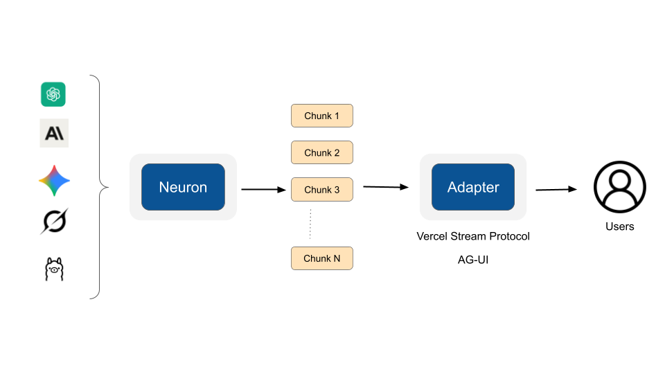
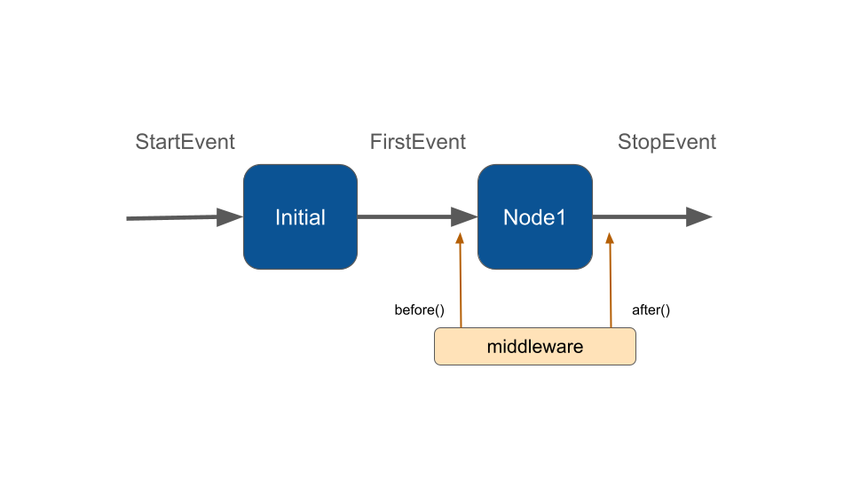

# Upgrade

## Upgrade to v3 from v2

In this new major version the public APIs of Neuron components weren't changed dramatically (we minimized the impact as much as possible), but the underlying architecture of Agent, RAG, and the Message system have been completely rebuilt on top of the Workflow component that now powers the entire framework.

Now Agent and RAG are no longer simple objects but workflows. They inherit features that were impossible to integrate in the previous standalone implementation, such as:&#x20;

* The unified [messaging system](../agent/messages.md#the-unified-messaging-layer) for multi-modal agents
* Native support for [tool approval](../agent/middleware.md#human-in-the-loop) and fully customizable human-in-the-loop flows
* Multi-agent [streaming](https://docs.neuron-ai.dev/workflow/streaming) and collaboration.

We also took advantage of this release to fix other critical design issues emerged in the v2 like the **complete support for reasoning models across all providers**, and other design improvements to have more freedom to evolve the framework with less breaking changes in the future.

We continue to work to provide the best possible developer experience, to help you create successful AI products in PHP.

## Updating Dependencies

You should update the following dependencies in your application's `composer.json` file:

* **neuron-core/neuron-ai** to **^3.0**

## High Impact Changes

### New Agent namespace

The Agent class and related classes and traits have been moved from the root directory under the dedicated namespace `NeuronAI\Agent`.

You need to update the namespace in the files where you use the Agent class, from:

```php
use NeuronAI\Agent;
```

To:

```php
use NeuronAI\Agent\Agent;
```

The same for the SystemPrompt class. The new namespace is `NeuronAI\Agent\SystemPrompt`.

### Remove chatAsync()

The `chatAsync()` method was completely removed from the `AgentInterface`. If you are using this method in your application you have to switch to the new async pattern.

<a href="../agent/async.md" class="button primary" data-icon="arrow-right-long">Learn about Async</a>

### Agent return type

Since the Agent is now a workflow, you have slightly different APIs to actually run the agent and retrieve the LLM response.

Previously you will get an instance of a Message directly from the `chat()` method. Now the chat method returns a workflow state that you can use to retrieve the final agent response.&#x20;

The returning agent state allows you to eaily access the LLM response, but it makes also possible the inspection of other aspects of the internal execution of the agent. Here is an example of the new syntax to run an agent, and output the content generated by the LLM.

```php
// Previous versions chat() return the LLM response
$message = MyAgent::make()->chat(new UserMessage("Hi, who are you?"));

// V3 - you need to call "getMessage()"
$message = MyAgent::make()
    ->chat(new UserMessage("Hi, who are you?"))
    ->getMessage();

echo $message->getContent();
```

### Message Content Blocks

The content blocks now replace the old approach based on "attachments". The legacy attachment system has been removed. To migrate:

**Old Approach** (no longer available):

```php
$message = new UserMessage('Analyze this');
$message->addAttachment(new Image($url, AttachmentContentType::URL));
```

**New Approach**:

```php
// Simple text message (backward compatible)
$message = new UserMessage("Hi");

// New format for passing images, files, etc.
$message = new UserMessage([
    new TextBlock('Analyze this'),
    new ImageBlock($url, SourceType::URL)
]);

// Adding more blocks
$message->addContent(
    new TextBlock('Remeber to answer as you are a professinal concierge.')
);

// Print all the text content blocks
echo $message->getContent();
```

The method `getContent()`  didn't change, but now returns all text blocks concatenated skipping media types.

Block composition unlock multimodality support, and can be very helpful if you need to inject additional prompts or instructions dynamically along the execution.

<a href="../agent/messages.md" class="button primary" data-icon="arrow-right-long">Learn about Messages</a>

### Streaming Chunks

In previous versions the streaming interface will return simple string for LLM response chunk, and `ToolCallMessage`, or `ToolCallResultMessage` instances directly for tool related operations. This creates too direct a coupling between the message instances and your application reading the stream.

We implemented dedicated chunk classes `TextChunk`, `ReasoningChunk`,  `ToolCallChunk`, `ToolResultChunk`, and others, in order to have dedicated containers for each kind of stream delta. This more clear separation of concerns opened the door to the implementation of the [adapter system](upgrade.md#streaming-adapters), and give us more freedom to improve this layer in the future with less breaking changes to the unified message system.

#### ToolCallChunk

In the previous version Neuron stream directly the `ToolCallMessage` instance with the list of tools involved in the iteration. Now you get a dedicated `ToolCallChunk` for each tool the model is asking to run.

<a href="../agent/streaming.md" class="button primary" data-icon="arrow-right-long">Read more about streaming</a>

### Structured Output

We extended the role of the `SchemaProperty` attribute to be the source of truth for the JSON schema definition of a class property. It now supports `min`, `max`, `minLength`, `maxLength`, `anyOf`.

```php
use NeuronAI\StructuredOutput\SchemaProperty;

class Person 
{
    #[SchemaProperty(
        description: 'The user name.',
        required: true,
        minLength: 3,
        maxLength: 255,
    )]
    public string $name;
    
    #[SchemaProperty(
        description: 'What the user love to eat.', 
        required: false,
        min: 18,
        max: 64,
    )]
    public ?int $age = null;
}
```

#### Array of objects

If a property is an array of structured object, you no longer need to specify the doc-block of the property types, you can just list them in the `anyOf` argument:

```php
class Report
{
    #[SchemaProperty(
        description: 'The content of the report', 
        required: true,
        anyOf: [TextBlock::class, TableBlock::class, ImageBlock::class]
    )]
    public array $content;
}
```

<a href="../agent/structured-output.md" class="button primary" data-icon="arrow-right-long">Structured Output</a>

### Workflow Interrupt Request (Human In The Loop)

In the previous version when you asked for an interrupt inside a Node you could pass an array of data to inform the client about the reason and the actions behind the interruption.&#x20;


```php
$feedback = $this->interrupt(['message' => 'do you want to approve?']);
```


This lazy typed method led to inconsistencies and errors. We introduced the `InterruptRequest` primitive to help you create interrutpion flows with a typed structure for a safe UI integration.


```php
$feedback = $this->interrupt(new ApprovalRequest(
    reason: 'Do you want to approve?',
    actions: [
        new Action(...)
    ]
));
```


Learn more in the dedicated section of the documentation.

<a href="../workflow/human-in-the-loop.md" class="button primary" data-icon="arrow-right-long">Workflow interruption</a>

### Workflow Database Persistence Change

The name of the columns for the workflow persistence database table changed:

* data -> interrupt

<a href="../workflow/persistence.md" class="button primary" data-icon="arrow-right-long">Workflow presistence</a>

## Medium Impact

### Rename ToolCallResultMessage

This class was renamed to `ToolResultMessage`.

### Monitoring & Observers

Agent, RAG, and Workflow entities no longer implement the PHP `\SplSubject` interface, and the observer classes no longer implement the `\SplObserver` interface. We introduced the new `ObserverInterface` that must be implemented only by event listeners like `LogObserver`. This lighter structure helped us to make the workflow building blocks observable like Workflow, node, and middleware. This means you can emit events from your custom nodes, and you only need to create and register your custom observer to listen for these events.

Read more on the [Monitoring section](../agent/observability.md).

### Remove HttpClientOptions

This class was removed in favor a complete abstraction of the HttpClient inside the framework. We adopted an adapter pattern to allow you inject custom http clients into the framework components, and customize their configuration. The Guzzle client adapter also support handler stack, custom headers, etc.

You can see an example of how to customize the Http client configuration in the [Async](../agent/async.md) section.

### Qdrant 1.10.x

The Qdrant vector store components was updated to support the new [query APIs](https://api.qdrant.tech/api-reference/search/query-points) that are included starting from the version 1.10.x. If you use a previous version of the Qdrant database you need to upgrade your instance.

### AbstractChatHistory methods signature

If you have implemented a custom chat history component you need to adjust the signature of the hook methods. They changed the visibility level, from public to protected, and they no longer have a return type:

```php
class MyChatHistory extends AbstractChatHistory
{
    protected function setMessages(array $messages): void
    {
        // Handle saving the entire history at once.
    }

    protected function onNewMessage(Message $message): void
    {
        // Handle single message addition.
    }

    protected function onTrimHistory(int $index): void
    {
        // When the trim is triggered, the messages in the position from zero to $index must be removed.
    }

    protected function clear(): void
    {
        // Remove all messages.
    }
}
```

## New Features

### Tool Approval & Conditional Approval

Thanks to the human in the loop pattern supported by the underlying workflow architecture, we created a built-in middleware to enable Tool approval in your agent like a plu\&play feature:

```php
new ToolApproval(
    tools: [
        BuyTicketTool::class => function (array $args): bool {
            return $args['amount'] > 100;
        }
    ]
)
```

<a href="../agent/middleware.md#tool-approval-human-in-the-loop" class="button primary" data-icon="arrow-right-long">Tool Approval</a>

### Mistral Dedicated Provider

Mistral provider is no longer a pure OpenAI implementation, but it was evolved with its own API format implementation to support multi-modal input and reasoning models.

<a href="../providers/ai-provider.md#mistral" class="button primary" data-icon="arrow-right-long">Mistral AI Provider</a>

### Cohere AI Provider

This version ships with a brand new provider to support Cohere inference platform both cloud and privately deployed.&#x20;

<a href="../providers/ai-provider.md#cohere" class="button primary" data-icon="arrow-right-long">Cohere AI Provider</a>

### Text-To-Speech providers

Thanks to the new block composition of messages it's easy now to deal with input and output multimodality. In this release we included a couple of providers you can use to process audio contents.

<a href="../providers/audio.md" class="button primary" data-icon="arrow-right-long">Text-To-Speech providers</a>

### Streaming Adapters

Adapters act as translators between Neuron's internal streaming events (text chunks, tool calls, reasoning steps) and specific frontend protocols like Vercel AI SDK, AG-UI, or your custom frontend needs.&#x20;

This architecture allows you to seamlessly integrate Neuron agents with various frontend frameworks (React, Vue, etc.) without modifying your core agent logic.

<figure><figcaption></figcaption></figure>

<a href="../agent/streaming.md#stream-adapters" class="button primary" data-icon="arrow-right-long">Learn more about Adapters</a>

### File ID content block

Usually you can attach files to your message (images or documents) as URLs, or encoded in base64 format. Many provider allows you to upload files on their platform once, and reference these files with a simple ID in the message. This can generate big savings in token consumption and can improve model response time.

After receiveing the file ID from the provider platofrm you can add a file block to your message with  `SourceType::ID`.

```php
// Reference a file ID previously uploaded on the provider platform
$message = new UserMessage([
    new TextBlock('Analyze this'),
    new FileBlock("file_id_xxxx", SourceType::ID)
]);
```

You can do the same with Image, Video, etc, based on your provider specifications.

### Middleware

Middleware provides a way to tightly control what happens inside the workflow and therefore also in your Agents and RAGs, since they too are workflows now.&#x20;

The core Workflow execution involves calling nodes based on the events returned by other nodes. Middleware exposes hooks to step inside `before` and `after`  the execution of nodes:

<figure><figcaption></figcaption></figure>

This architecture has been used to create the [buit-in middlewares](../agent/middleware.md) for the Agent class, like context summarization, or tool approval.

<a href="../workflow/middleware.md" class="button primary" data-icon="arrow-right-long">Learn more about Middleware</a>
