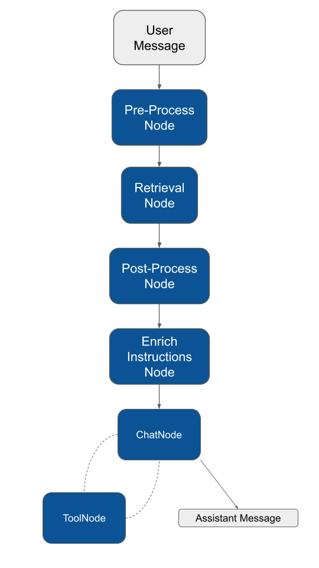

# Getting Started


### PREREQUISITES

This guide assumes you are already familiar with the following concepts:

* [Agent](../agent/agent.md)
* [Tool & Function Call](../agent/tools.md)


Retrieval-Augmented Generation (RAG) is the process of providing references to a knowledge base outside of the LLM training data sources before generating a response.&#x20;

Large Language Models (LLMs) are trained on vast volumes of data to be able to generate original output for tasks like answering questions, translating languages, and completing sentences. RAG extends the already powerful capabilities of LLMs to specific domains or an organization's internal knowledge base, all without the need to retrain the model.&#x20;

It is a cost-effective approach to improving LLM output so it remains relevant, accurate, and useful also working on your own private data.

## Why RAG systems are relevant

Building a RAG system is the way to use the powerful LLM capabilities on your own private data. You can create applications capable of accurately answering questions about company internal documentations. Or chatbot to serve external customers on the internal rules of an organization.

If it's not about the usage of private data, you can think of RAG as a way to provide the latest research, statistics, or news to the generative models.

## How to create a RAG system

Without RAG, the LLM takes the user input and creates a response based on information it was trained on (what it already knows).&#x20;

With RAG, an information retrieval component is introduced. It utilizes the user input to first pull information from a new data source. The user query and the relevant information retrieved are both given to the LLM. The LLM uses the new knowledge and its training data to create accurate responses. The following sections provide an overview of the process.

Even if it can appear a little bit complicated, don't worry, this is just to make you aware of the process. Most of these things are automatically managed by the Neuron RAG agent.

There are three most important steps to create a RAG system.

### Process external data

The external data you want to use to augment the default LLM knowledge may exist in various formats like files, database records, or long-form text.

Before being able to submit this data to the LLM you have to convert them into a specific format called "[Embeddings](https://inspector.dev/vector-store-ai-agents-beyond-the-traditional-data-storage/)".

### Retrieval

The embeddings you have generated by processing documents and data need to be stored in specific databases able to deal with this particlar format. These database are called "[Vector Store](https://inspector.dev/vector-store-ai-agents-beyond-the-traditional-data-storage/)".

Vector store are not only able to store this data, but also to perform a particular form of search: the "similarity search" between the existing data in the database an a query we provide.&#x20;

### Augment the LLM prompt

Next, the RAG agent augments your input (or prompt) by adding the relevant retrieved data in the context to make the LLM aware of the custom data before generating the response.

You just need to take care of the first step "Process external data", and Neuron gives you the toolkit to make it simple. The other steps are automatically managed by the Neuron RAG agent.



## Monitoring & Debugging

Many of the applications you build with Neuron will contain multiple steps with multiple invocations of LLM calls, external data sources, tools, and more. As these applications get more and more complex, it becomes crucial to be able to inspect what exactly is going on inside your agentic system. The best way to do this is with [Inspector](https://inspector.dev/).

After you sign up at the link above, make sure to set the `INSPECTOR_INGESTION_KEY` variable in the application environment file to start monitoring:


```
INSPECTOR_INGESTION_KEY=nwse877auxxxxxxxxxxxxxxxxxxxxxxxxxxxx
```


## Create a RAG Agent

To create a RAG you need to attach some additional components other than the AI provider, such as a `vector store`, and an `embeddings provider`.

First, let's create the RAG class:



```bash
vendor/bin/neuron make:rag App\\Neuron\\MyChatBot
```



```powershell
.\vendor\bin\neuron make:rag App\Neuron\MyChatBot
```



Here is an example of a RAG implementation:

```php
namespace App\Neuron;

use NeuronAI\Providers\AIProviderInterface;
use NeuronAI\Providers\Anthropic\Anthropic;
use NeuronAI\RAG\Embeddings\EmbeddingsProviderInterface;
use NeuronAI\RAG\Embeddings\OpenAIEmbeddingsProvider;
use NeuronAI\RAG\RAG;
use NeuronAI\RAG\VectorStore\FileVectorStore;
use NeuronAI\RAG\VectorStore\VectorStoreInterface;

class MyChatBot extends RAG
{
    protected function provider(): AIProviderInterface
    {
        return new Anthropic(
            key: 'ANTHROPIC_API_KEY',
            model: 'ANTHROPIC_MODEL',
        );
    }
    
    protected function embeddings(): EmbeddingsProviderInterface
    {
        return new OpenAIEmbeddingsProvider(
            key: 'OPENAI_API_KEY',
            model: 'OPENAI_MODEL'
        );
    }
    
    protected function vectorStore(): VectorStoreInterface
    {
        return new FileVectorStore(
            directory: __DIR__,
            name: 'demo'
        );
    }
}
```


Explore [**Data Loaders**](data-loader.md) to learn how to populate the vector store with embeddings representing the knowledge you want to integrate as additional knowledge.


### Talk to the chat bot

Imagine having previously populated the vector store with the knowledge base you want to connect to the RAG agent, and now you want to ask questions. Check out [**Data Loaders**](data-loader.md) to laern about RAG data population.

To start the execution of a RAG you call the `chat()`  method:

```php
use App\Neuron\MyChatBot;
use NeuronAI\Chat\Messages\UserMessage;

$message = MyChatBot::make()
    ->chat(
        new UserMessage('I want to know more about Inspector AI Bug Fix.')
    )
    ->getMessage();
    
echo $message->getContent();

// Sure, Inspector AI Bug Fix is an agentic monitoring tool 
// that provides bug fix proposals in real-time as an error occurs 
// in your application.
```

## Feed Your RAG With Documents

Once you have defined the components of your RAG system it's time to feed the vector database with embedded chunks of text.

Neuron provides you with [Data Loaders](data-loader.md) to help you set up a data loading pipeline with just a few lines of code. You can see an example below. To learn more about data loader you should check out the [dedicated documentation](data-loader.md):&#x20;

```php
use App\Neuron\MyChatBot;
use NeuronAI\RAG\DataLoader\FileDataLoader;

MyChatBot::make()->addDocuments(
    // Use the file data loader component to load a text file into the vector store
    FileDataLoader::for(__DIR__.'/my-article.md')->getDocuments()
);
```

## RAG + Tools

The Neuron's RAG class extends the basic `\NeuronAI\Agent` class. This means that your RAG is always an agent and you can also attach tools and define system instructions in your implementation.&#x20;

Imagine we want to implement an agent able to give workout tips based on the user data. Here is an example of a complete implementation:

```php
namespace App\Neuron;

use NeuronAI\Providers\AIProviderInterface;
use NeuronAI\Providers\Anthropic\Anthropic;
use NeuronAI\RAG\Embeddings\EmbeddingsProviderInterface;
use NeuronAI\RAG\Embeddings\OpenAIEmbeddingsProvider;
use NeuronAI\RAG\RAG;
use NeuronAI\RAG\VectorStore\FileVectorStore;
use NeuronAI\RAG\VectorStore\VectorStoreInterface;
use NeuronAI\Tools\Toolkits\Calculator\CalculatorToolkit;

class WorkoutTipsAgent extends RAG
{
    protected function provider(): AIProviderInterface
    {
        return new Anthropic(
            key: 'ANTHROPIC_API_KEY',
            model: 'ANTHROPIC_MODEL',
        );
    }
    
    public function instructions(): string
    {
        return (string) new SystemPrompt(
            background: ["You are an AI Agent specialized in providing workout tips."],
        );
    }
    
    protected function embeddings(): EmbeddingsProviderInterface
    {
        return new OpenAIEmbeddingsProvider(
            key: 'OPENAI_API_KEY',
            model: 'OPENAI_MODEL'
        );
    }
    
    protected function vectorStore(): VectorStoreInterface
    {
        return new FileVectorStore(
            directory: __DIR__,
            name: 'demo'
        );
    }
    
    protected function tools(): array
    {
        return [
            CalculatorToolkit::make(),
        ];
    }
}
```

In the example above we created a RAG agent that is able to give workout tips to the user. We can load into the vector store the knowledge for the specific workouts you provide, so the agent has the knowledge to provide tips based on the current workout status of the user retrieved from the database with the tool we attached.

### RAG Workflow

In the following image you can see the complete representation of the workflow Neuron runs for a RAG application. Learning this structure can help you better understand the underlying execution process to hook the system using middleware:

<figure><figcaption></figcaption></figure>

Once the `UserMessage` comes into the system, it runs in order:

* `PreProcessQueryNode`: Run the [pre-processors](pre-post-processor.md#pre-processors) pipeline like `QueryTransformationPreProcessor` to reinforce the input prompt.
* `RetrieveDocumentsNode`: Execute the [retrieval strategy](retrieval.md) from the vector store or external data sources
* `PostProcessDocumentsNode`: Run the [post-processors](pre-post-processor.md#post-processors) pipeline like reranking
* `EnrichInstructionsNode`: Add the final documents to the system prompt of the agent
* `ChatNode`: Run the inference and collect the LLM response
* `ToolNode`: If the agent has tool attached, the model can ask their execution eventually.

Finally the RAG will return the LLM message to you.
