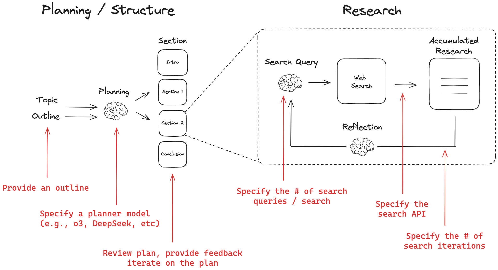
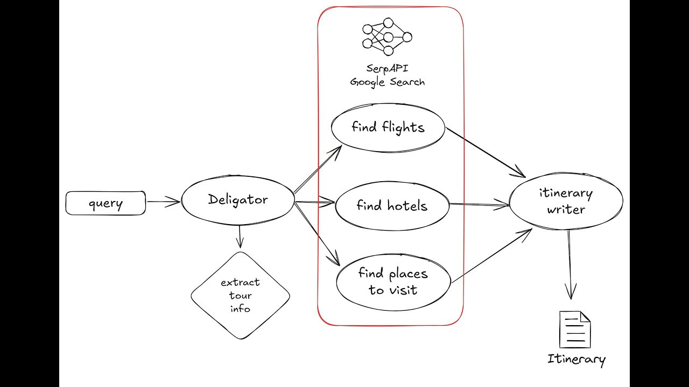
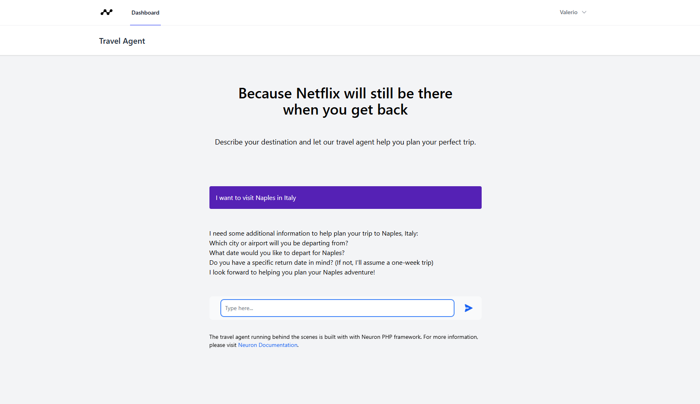

# Examples

## Deep Research Agent

This project is inspired by Open Deep Research, which uses LangGraph for implementation. Other implementations exist also for llamaindex, and others. Our version leverages Neuron to create a powerful, modular workflow for research and analysis.

Neuron Open Deep Research provides a structured approach to generating comprehensive research reports on any topic using large language models, with a focus on modularity, extensibility, and real-time results.

<figure><figcaption><p><a href="https://github.com/neuron-core/deep-research-agent">https://github.com/neuron-core/deep-research-agent</a></p></figcaption></figure>

### Architecture

**DeepResearchAgent**: Orchestrates the overall report generation process

* **Planning**: Creates the structure of the report
* **GenerateSectionContent**: Generates content for each section using search results
* **Format**: Compiles the final report

**SearchWorkflow**: Handles search operations as a nested workflow

* **GenerateQueries**: Creates search queries based on section topics
* **SearchTheWeb**: Executes parallel searches and processes results

<a href="https://github.com/neuron-core/deep-research-agent" class="button secondary" data-icon="github">Check out the GitHub repository</a>

## Travel Planner Agent

This project demonstrates how to create a tour planner using Neuron PHP framework for agentic applications.

Stack Used:

* Neuron Workflow for multi-agent orchestration.
* [SerpAPI](https://serpapi.com/) for finding hotels, flights and places to visit comprehensive research reports on any topic using large language models, with a focus on modularity, extensibility, and real-time results.

<figure><figcaption><p><a href="https://github.com/neuron-core/travel-planner-agent">https://github.com/neuron-core/travel-planner-agent</a></p></figcaption></figure>

### Architecture

**TravelPlannerAgent**: Orchestrates the overall itinerary generation process

#### Nodes

* **Receptionist**: Collect all the information from the user
* **Delegator**: Generates single reports for flights, hotels, and places to visit
  * _Flights_
  * _Hotels_
  * _Places_
* **GenerateItinerary**: Generates the final report

<a href="https://github.com/neuron-core/travel-planner-agent" class="button secondary" data-icon="github">Check out the GitHub Repository</a>

## Laravel Travel Agent

This project demonstrates how to integrate multi-agent workflows in a Laravel application using Neuron PHP AI framework.&#x20;

Stack Used:

* [Laravel](https://laravel.com/) and [Livewire](https://livewire.laravel.com/) for the application.
* [Neuron Workflow](https://docs.neuron-ai.dev/workflow/getting-started) for multi-agent orchestration.
* [SerpAPI](https://serpapi.com/) for finding hotels, flights and places to visit comprehensive research reports on any topic using large language models, with a focus on modularity, extensibility, and real-time results.

<figure><figcaption></figcaption></figure>

### How to use this project

Download the project on your machine and open your terminal in the project directory. First, install the composer dependencies:

```bash
composer install

npm run build

php artisan migrate
```

Create a `.env` file in your project root (see `.env.example` for a template), and provides the API keys based on the service you want to connect with.

```
# At least one required
ANTHROPIC_API_KEY=
GEMINI_API_KEY=
OPENAI_API_KEY=

#Required
SERPAPI_KEY=

# Optional
INSPECTOR_INGESTION_KEY=
INSPECTOR_TRANSPORT=sync
```

Open the project in your browser, register an account, and start planning your trip.
