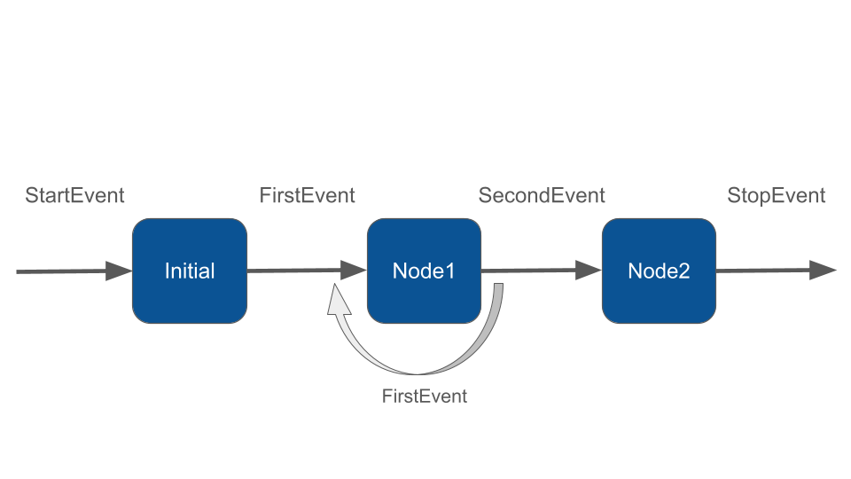
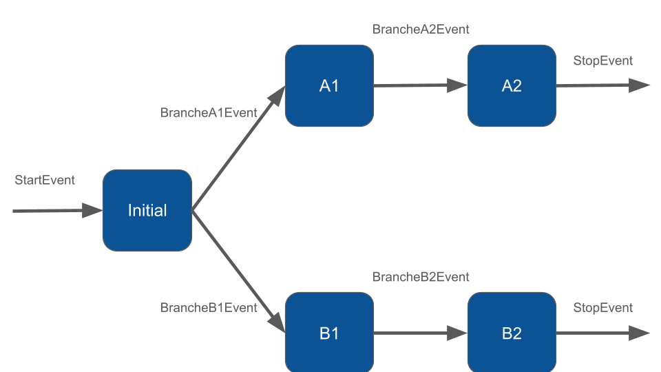

# Loops & Branches

Workflow makes branching and looping logic, more simply and flexibly than graph-based approaches.

### Loops

To create a loop, we'll take our example MyWorkflow from the previous tutorial and modify the `NodeOne` implementation to randomly decide either to loop or to continue:

```php
class NodeOne extends Node
{
    public function __invoke(FirstEvent $event, WorkflowState $state): FirstEvent|SecondEvent
    {
        echo "\n- ".$event->firstMsg;
        
        if (rand(0, 1) === 1) {
            // Returning FirstEvent it will trigger another execution of NodeOne
            return new FirstEvent("Running a loop on NodeOne");
        }
        
        return new SecondEvent("NodeOne complete");
    }
}
```


Notice that we've added "FirstEvent" as an additional return type for the `__invoke` method.


Returning FirstEvent will trigger another execution of `NodeOne`. The final output could be:

```php
$state = Workflow::make()
    ->addNodes([
        new InitialNode(),
        new NodeOne(),
        new NodeTwo()
    ])
    ->start()
    ->getResult();

/*
- Handling StartEvent
- InitialNode complete
- Running a loop on NodeOne
- Running a loop on NodeOne
- NodeOne complete
- NodeTwo complete
*/
```

You can create a loop from any node to any other node by defining the appropriate event types and return types. In this example the node can return FirstEvent, which is managed by itself. Thanks to event types you can come back to any other node in the workflow.

<figure><figcaption></figcaption></figure>

### Branches

Closely related to looping is branching. As you've already seen, you can conditionally return different events. Let's see a workflow that branches into two different paths. First let's create some custom events:

```php
namespace App\Neuron;

class BrancheA1Event implements Event 
{
    public function __construct(protected string $firstMsg){}
}

class BrancheA2Event implements Event 
{
    public function __construct(protected string $secondMsg){}
}

class BrancheB1Event implements Event 
{
    public function __construct(protected string $secondMsg){}
}

class BrancheB2Event implements Event 
{
    public function __construct(protected string $secondMsg){}
}
```

In the initial node of he workflow we decide what branched we want to go through. Remeber to always define the appropriate return types in the `__invoke` method signature:

```php
class InitialNode extends Node
{
    public function __invoke(StartEvent $event, WorkflowState $state): BrancheA1Event|BrancheB1Event
    {
        if (rand(0, 1) === 1) {
            // Returning FirstEvent it will trigger another execution of NodeOne
            return new BrancheA1Event();
        }
        
        return new BrancheB1Event();
    }
}
```

The other nodes will move forward sequencially.

```php
$state = Workflow::make()
    ->addNodes([
        new InitialNode(),
        new A1Node(),
        new A2Node(),
        new B1Node(),
        new B2Node(),
    ])
    ->start()
    ->getResult();
```

<figure><figcaption></figcaption></figure>

You can of course combine branches and loops in any order to fulfill the needs of your application.&#x20;

### Monitoring & Debugging

Before moving into the Workflow creation process, we recommend having the monitoring system in place. It could make the learning curve of how Workflow works much more easier. The best way to monitoring Workflow is with [Inspector](https://inspector.dev/).

After you sign up at the link above, make sure to set the `INSPECTOR_INGESTION_KEY` variable in the application environment file to monitoring Workflow execution:


```
INSPECTOR_INGESTION_KEY=nwse877auxxxxxxxxxxxxxxxxxxxxxxxxxxxx
```

