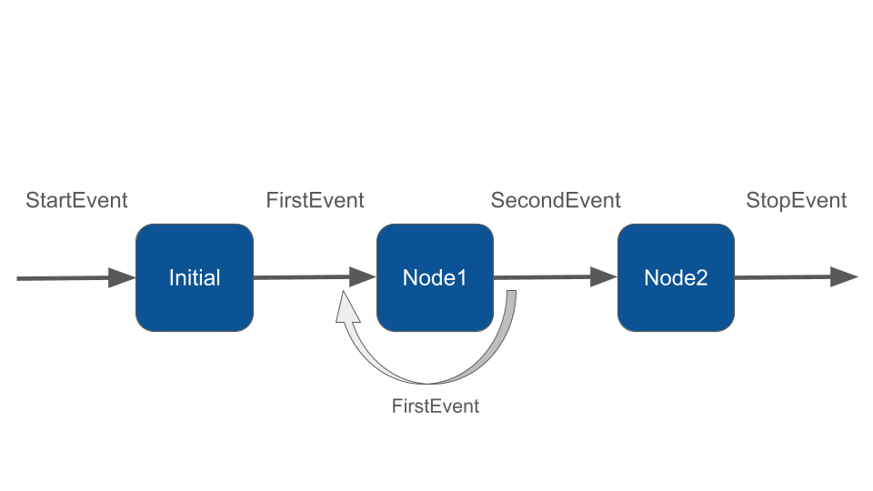
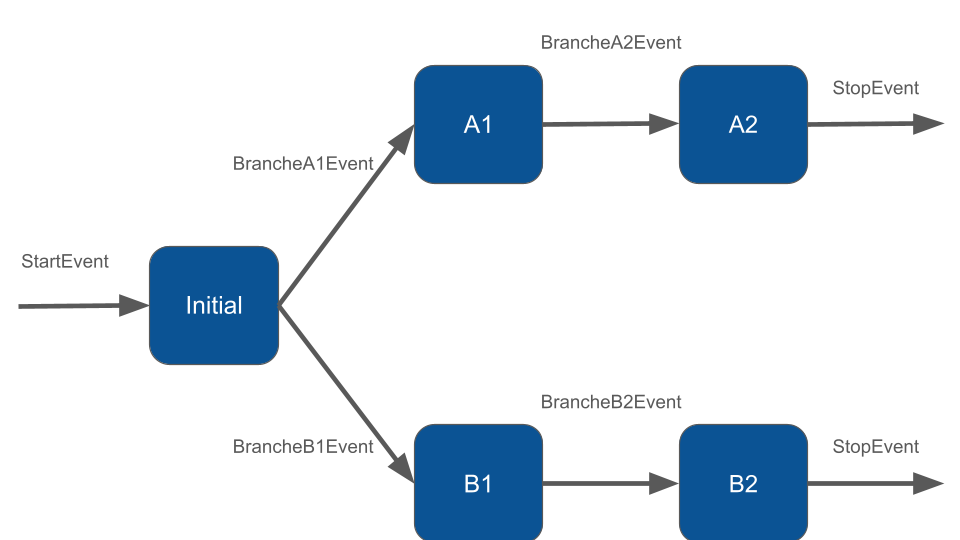

# Loops & Branches

Workflow makes branching and looping logic easy to implement thanks to its event driven design. Once you understand how nodes belong to events, it's easy to start imagining how you can create loops and branching, which is just deciding which event should be returned in an "if condition" or whatever logic.

## Loops

To create a loop, simply return the entry event of a previous node as the exit event of the current node. You can also use the same entry event as the current node's exit event to loop over the current node.

Take a look at the example below. The `NodeOne` can have two events as return type, `FirstEvent` and `SecondEvent`. If the node returns FirstEvent it will cause another execution of the same node because FirstEvent is handled by itself, creating a loop.

If the node returns `SecondEvent` it will finally move forward the execution to another node.&#x20;

```php
class NodeOne extends Node
{
    public function __invoke(FirstEvent $event, WorkflowState $state): FirstEvent|SecondEvent
    {
        echo "\n- ".$event->firstMsg;
        
        if (rand(0, 1) === 1) {
            // Returning FirstEvent it will trigger another execution of NodeOne
            return new FirstEvent("Running a loop on NodeOne");
        }
        
        return new SecondEvent("NodeOne complete, move forward");
    }
}
```


Notice the node has now two return types for the `__invoke` method: `FirstEvent` and `SecondEvent`. You have to declare all possible return events on the method signature to let the Workflow build the execution chain.


Returning FirstEvent will trigger another execution of `NodeOne`. So the final output could be:

```php
$state = Workflow::make()
    ->addNodes([
        new InitialNode(),
        new NodeOne(),
        new NodeTwo()
    ])
    ->init()
    ->run();

/*
- Handling StartEvent
- InitialNode complete
- Running a loop on NodeOne
- Running a loop on NodeOne
- NodeOne complete, move forward
- NodeTwo complete
*/
```

You can create a loop from any node to any other node in the workflow by defining the appropriate input event and return events of the invoke method.&#x20;

<figure><figcaption></figcaption></figure>

The `NodeOne` can even return a StartEvent to jump right to the first node of the Workflow. The event driven architecutre allows you to directly point any node in the workflow both forward and backward.

## Branches

As you've already seen, you can conditionally return different events from a node to define custom execution flows. In this section we'll see an example of a workflow that branches into two different paths.&#x20;

First let's create some custom events:

```php
namespace App\Neuron;

class BrancheA1Event implements Event 
{
    public function __construct(protected string $firstMsg){}
}

class BrancheA2Event implements Event 
{
    public function __construct(protected string $secondMsg){}
}

class BrancheB1Event implements Event 
{
    public function __construct(protected string $secondMsg){}
}

class BrancheB2Event implements Event 
{
    public function __construct(protected string $secondMsg){}
}
```

In the initial node of he workflow we decide what branched we want to go through. Remeber to always define the appropriate return types in the `__invoke` method signature:

```php
class InitialNode extends Node
{
    public function __invoke(StartEvent $event, WorkflowState $state): BrancheA1Event|BrancheB1Event
    {
        if (rand(0, 1) === 1) {
            // Returning FirstEvent it will trigger another execution of NodeOne
            return new BrancheA1Event();
        }
        
        return new BrancheB1Event();
    }
}
```

The other nodes will move forward sequencially.

```php
$state = Workflow::make()
    ->addNodes([
        new InitialNode(),
        new A1Node(),
        new A2Node(),
        new B1Node(),
        new B2Node(),
    ])
    ->init()
    ->run();
```

<figure><figcaption></figcaption></figure>

You can of course combine branches and loops in any order to fulfill the needs of your application.

## Parallel Branches

When you want to call the execution of multiple branches in parallel you need to return the special event `ParallelEvent`  from your node.

```php
use NeuronAI\Workflow\Events\ParallelEvent;

class DocumentProcessing extends Node
{
    public function __invoke(StartEvent $event, WorkflowState $state): ParallelEvent
    {
        // Node logic here...
	
        // Finally return a ParallelEvent
        return new ParallelEvent([
            'text' => new TextProcessEvent(),
            'image' => new ImageProcessEvent(),
        ]);
    }
}
```

The `ParallelEvent` must be constructed with an array of `<branch_name> => <FirstInputEvent>`:

```php
new ParallelEvent([
	<branch_name> => <FirstInputEvent>
	...
])
```

Nodes handling the events you declare for each branch must be registered in the workflow:

```php
class MyWorkflow extends Workflow
{
	protected function nodes(): array
	{
		return [
			new DocumentProcessing(),
			
			// "text" branch
			new DescriptionGenerationNode(), // Handle TextProcessEvent
			new TextRefactorNode(),
			
			// "image" branch
			new ImageProcessNode(), // Handle ImageProcessEvent
			new AddWatermarkNode(),
			
			new MergeNode(),
		];
	}
}
```

A branch can be just one node, or a list of multiple nodes always connected with events.

### Handle the END of branches

The last node in your branch must return the framework built-in `StopEvent`.

In the example above `TextRefactorNode` and `AddWatermarkNode` will declare the end of their branch returning StopEvent:

```php
class AddWatermarkNode extends Node
{
    public function __invoke(TextProcessEvent $event, WorkflowState $state): StopEvent
    {
        // Node code here...
		
        // Returning StopEvent the branch ends
        return new StopEvent(result: 'Hello World!');
    }
}
```

Notice: StopEvent can also carry some results.

### Handle the final result

The `ParallelEvent` returned by the `DocumentProcessing` node is basically waiting the end of branches execution before being forwarded to the next node.

In the example above, the `MergeNode` is in charge to finally handle the `ParallelEvent`:

```php
class MergeNode extends Node
{
    public function __invoke(ParallelEvent $event, WorkflowState $state): StopEvent
    {
        $textBranchResult = $event->getResult('text');
        $imageBranchResult = $event->getResult('image');
        
        return new StopEvent();
    }
}
```

This node can read the final result of each branch with the `getResult()` method passing the `<branch_name>`.

As usual the merge node can stop the workflow, or return other events moving the workflow forward.

### Branch State Isolation

Branches will receive a copy of the Workflow state, so they can start with the same Workflow information, but every change will affect only the branch state. They are completely isolated.

The only way to send result back to the main workflow is adding result data to the `StopEvent`.

### AsyncExecutor

We also provide an implementation of the internal workflow executor that allows you to run multiple branches concurrently. To use the `AsyncExecutor` you need to install the [Amp](https://github.com/amphp/amp) package:

```bash
composer require amphp/amp
```

```php
class MyAgent extends Workflow 
{
		/**
     * Use the AsyncExecutor
     */
    protected function executor(): WorkflowExecutorInterface
    {
        return new AsyncExecutor();
    }
	
		protected function nodes(): array
		{
			return [...];
		}
}
```

This is particularly useful if you want to run multiple agentic tasks in parallel, since Neuron AI already provides the `AmpHttpClient` that you can inject into all components.

```php
use NeuronAI\HttpClient\AmpHttpClient;

class DescriptionGenerationNode extends Node
{
    public function __invoke(TextProcessEvent $event, WorkflowState $state): StopEvent
    {
				$input = new UserMessage('Describe this image');
				$input->addContent(
					new ImageContent(...)
				);
			
				$response = AsyncAgent::make()
					->chat($input)
					->getMessage()
		
        return new StopEvent(result: $response);
    }
}
```

## Monitoring & Debugging

Before moving into the Workflow creation process, we recommend having the monitoring system in place. It could make the learning curve of how Workflow works much more easier. The best way to monitoring Workflow is with [Inspector](https://inspector.dev/).

After you sign up at the link above, make sure to set the `INSPECTOR_INGESTION_KEY` variable in the application environment file to monitoring Workflow execution:


```
INSPECTOR_INGESTION_KEY=nwse877auxxxxxxxxxxxxxxxxxxxxxxxxxxxx
```

