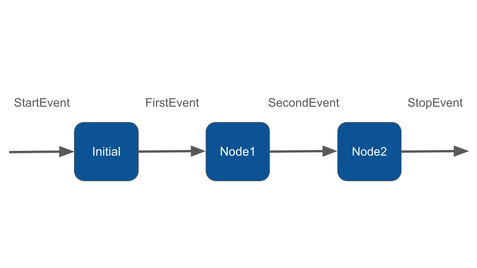

# Multi Step Workflow

Multiple steps are created by defining custom events that can be emitted by nodes and trigger other nodes. Let's define a simple 3-step workflow.

### Custom Events

We define two custom events, `FirstEvent` and `SecondEvent`. These classes can have any names and properties, but must implement `Event`:

```php
namespace App\Neuron;

class FirstEvent implements Event 
{
    public function __construct(protected string $firstMsg){}
}

class SecondEvent implements Event 
{
    public function __construct(protected string $secondMsg){}
}
```

### Defining the workflow

Now we define the workflow itself. We do this by defining the input and output types on each node.



```bash
php vendor/bin/neuron make:node App\\Neuron\\InitialNode

php vendor/bin/neuron make:node App\\Neuron\\NodeOne

php vendor/bin/neuron make:node App\\Neuron\\NodeTwo
```



```powershell
php .\vendor\bin\neuron make:node App\Neuron\InitialNode

php .\vendor\bin\neuron make:node App\Neuron\NodeOne

php .\vendor\bin\neuron make:node App\Neuron\NodeTwo
```



Here is the minimal implementation for the purpose of this demo:

```php
namespace App\Neuron;

use NeuronAI\Workflow\Node;
use NeuronAI\Workflow\StartEvent;
use NeuronAI\Workflow\StopEvent;

// Gets the StartEvent and returns FirstEvent
class InitialNode extends Node
{
    public function __invoke(StartEvent $event, WorkflowState $state): FirstEvent
    {
        echo "\n- Handling StartEvent";
        
        return new FirstEvent("InitialNode complete");
    }
}

// Takes FirstEvent as input and returns SecondEvent
class NodeOne extends Node
{
    public function __invoke(FirstEvent $event, WorkflowState $state): SecondEvent
    {
        echo "\n- ".$event->firstMsg;
        
        return new SecondEvent("NodeOne complete");
    }
}

// Takes SecondEvent as input and returns StopEvent
class NodeTwo extends Node
{
    public function __invoke(SecondEvent$event, WorkflowState $state): StopEvent
    {
        echo "\n- ".$event->secondMsg;
        
        echo "\n- NodeTwo complete";
        
        return new StopEvent();
    }
}
```

Define the Workflow attaching the nodes:

```php
use NeuronAI\Workflow\Workflow;

$handler = Workflow::make()
    ->addNodes([
        new InitialNode(),
        new NodeOne(),
        new NodeTwo(),
    ])
    ->start();

/*
 * Run the workflow
 */
$handler->getResult();
```

The full output will be:

```
- Handling StartEvent
- InitialNode complete
- NodeOne complete
- NodeTwo complete
```

<figure><figcaption></figcaption></figure>

Of course there is still not much point to a workflow if you just run through it from beginning to end! Let's do some branching and looping.

### Monitoring & Debugging

Before moving into the Workflow creation process, we recommend having the monitoring system in place. It could make the learning curve of how Workflow works much more easier. The best way to monitoring Workflow is with [Inspector](https://inspector.dev/).

After you sign up at the link above, make sure to set the `INSPECTOR_INGESTION_KEY` variable in the application environment file to monitoring Workflow execution:


```
INSPECTOR_INGESTION_KEY=nwse877auxxxxxxxxxxxxxxxxxxxxxxxxxxxx
```

