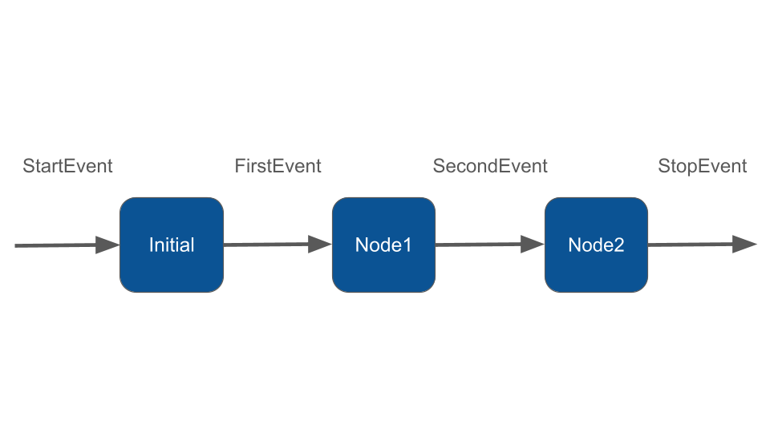

# Multi Step Workflow

Multiple steps are created by defining custom events that can be emitted by nodes and trigger other nodes. Let's define a simple 3-step workflow.

### Custom Events

We define two custom events, `FirstEvent` and `SecondEvent`. These classes can have any names and properties, but must implement `Event`:



```bash
vendor/bin/neuron make:event App\\Neuron\\FirstEvent
```



```powershell
.\vendor\bin\neuron make:event App\Neuron\FirstEvent
```



```php
namespace App\Neuron;

class FirstEvent implements Event 
{
    public function __construct(protected string $firstMsg){}
}

class SecondEvent implements Event 
{
    public function __construct(protected string $secondMsg){}
}
```

### Defining the workflow

Now we define the workflow itself. We do this by defining the input and output types on each node. Here is the minimal implementation of the nodes for the purpose of this demo.

<figure><figcaption></figcaption></figure>

#### InitialNode



```bash
vendor/bin/neuron make:node App\\Neuron\\InitialNode
```



```powershell
.\vendor\bin\neuron make:node App\Neuron\InitialNode
```



```php
namespace App\Neuron;

use NeuronAI\Workflow\Node;
use NeuronAI\Workflow\StartEvent;
use App\Neuron\FirstEvent;

class InitialNode extends Node
{
    /**
     * Gets the "StartEvent" and returns "FirstEvent"
     */
    public function __invoke(StartEvent $event, WorkflowState $state): FirstEvent
    {
        echo "\n- Handling StartEvent";
        
        return new FirstEvent("InitialNode complete");
    }
}
```

#### NodeOne



```bash
vendor/bin/neuron make:node App\\Neuron\\NodeOne
```



```powershell
.\vendor\bin\neuron make:node App\Neuron\NodeOne
```



```php
class NodeOne extends Node
{
    /**
     * Takes "FirstEvent" as input and returns "SecondEvent"
     */
    public function __invoke(FirstEvent $event, WorkflowState $state): SecondEvent
    {
        echo "\n- ".$event->firstMsg;
        
        return new SecondEvent("NodeOne complete");
    }
}
```

#### NodeTwo



```bash
vendor/bin/neuron make:node App\\Neuron\\NodeTwo
```



```powershell
.\vendor\bin\neuron make:node App\Neuron\NodeTwo
```



```php
class NodeTwo extends Node
{
    /**
     * Takes "SecondEvent" as input and returns "StopEvent"
     */
    public function __invoke(SecondEvent $event, WorkflowState $state): StopEvent
    {
        echo "\n- ".$event->secondMsg;
        
        echo "\n- NodeTwo complete";
        
        return new StopEvent();
    }
}
```

Define the Workflow attaching the nodes:

```php
use NeuronAI\Workflow\Workflow;

$handler = Workflow::make()
    ->addNodes([
        new InitialNode(),
        new NodeOne(),
        new NodeTwo(),
    ])
    ->init();

/*
 * Run the workflow
 */
$handler->run();
```

The full output will be:

```
- Handling StartEvent
- InitialNode complete
- NodeOne complete
- NodeTwo complete
```

Of course there is still not much point to a workflow if you just run through it from beginning to end! Let's do some branching and looping.

### Monitoring & Debugging

Many of the applications you build with Neuron will contain multiple steps with multiple invocations of LLM calls. As these applications get more and more complex, it becomes crucial to be able to inspect what exactly is going on inside your agentic system. The best way to do this is with [Inspector](https://inspector.dev/).


