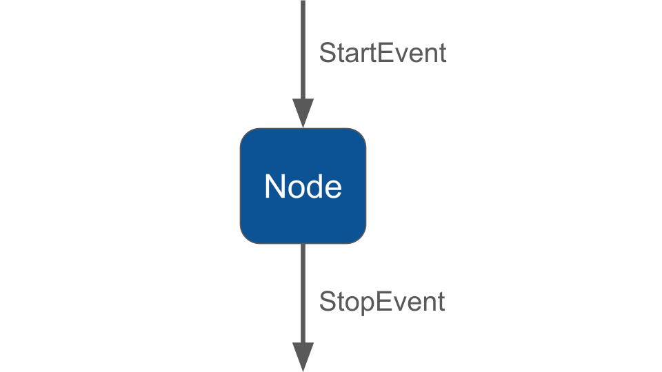

# Single Step Workflow

### Create a Workflow

A workflow is usually implemented as a class that inherits from Workflow. The class can define an arbitrary number of nodes, each of which is a class that extens `NeuronAI\Workflow\Node`.

First, let's create the MyWorkflow class:



```bash
vendor/bin/neuron make:workflow App\\Neuron\\MyAgent
```



```powershell
.\vendor\bin\neuron make:workflow App\Neuron\MyAgent
```



Here is the simplest possible workflow:

```php
namespace App\Neuron;

use NeuronAI\Workflow\Workflow;

class MyAgent extends Workflow
{
    protected function nodes(): array
    {
        return [
            new InitialNode(),
        ];
    }
}
```

Now let's create the node:



```bash
vendor/bin/neuron make:node App\\Neuron\\InitialNode
```



```powershell
.\vendor\bin\neuron make:node App\Neuron\InitialNode
```



A Node is an invokable class to handle an incoming event, and return another event:

```php
namespace App\Neuron;

use NeuronAI\Workflow\Node;
use NeuronAI\Workflow\Events\StartEvent;
use NeuronAI\Workflow\Events\StopEvent;
use NeuronAI\Workflow\WorkflowState;

class InitialNode extends Node
{
    public function __invoke(StartEvent $event, WorkflowState $state): StopEvent
    {
        $state->set('answer', 'Hello World!');
        
        return new StopEvent();
    }
}
```

This will print "Hello World!" to the console:

```php
$finalState = MyWorkflow::make()->init()->run();

echo $finalState->get('answer'); // Print Hello World!
```

In this code we:



Define a class `MyWorkflow` that inherits from `Workflow`





Define a Node implementing the `__invoke` method





The step takes an event as input, which is an instance of `StartEvent`





The Node adds a value to the state and returns a `StopEvent`





We create an instance of `MyWorkflow`&#x20;





We start the workflow and get the result





Print the result in the console





<figure><figcaption></figcaption></figure>

### Start and Stop events&#xD;

`StartEvent` and `StopEvent` are special events that are used to start and stop a workflow. The node that accepts a StartEvent will be triggered first by when you start the workflow. Returning a StopEvent will end the execution of the workflow and return the final state, even if other nodes remain un-executed.

### Type hint for events

The $event types (e.g. `StartEvent`) guide the Workflow execution. The expected return types of a node determine what node will be triggered next.

Event types are validated at compile time, so you will get an error message if for instance you return an event that is never consumed by another Node.

### Monitoring & Debugging

Many of the applications you build with Neuron will contain multiple steps with multiple invocations of LLM calls. As these applications get more and more complex, it becomes crucial to be able to inspect what exactly is going on inside your agentic system. The best way to do this is with [Inspector](https://inspector.dev/).


